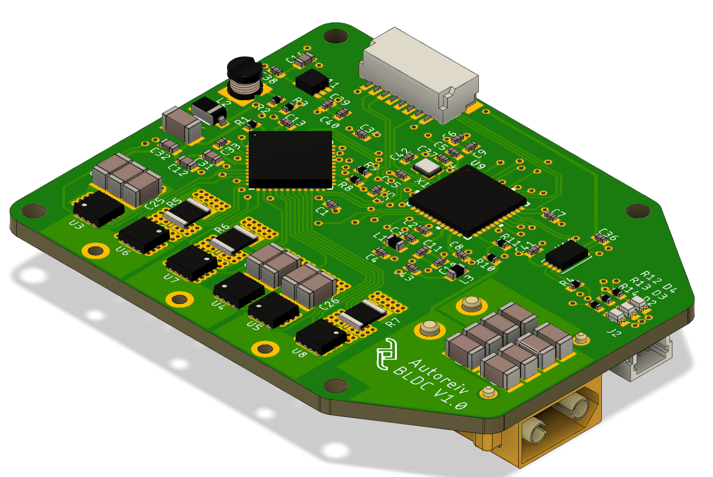

# Pino controller

Bare-metal BLDC controller for Pino the robot, written in
[Rust](https://www.rust-lang.org)!



-----

_**Disclaimer: I'm quite new at Rust, so please bear with me**_

This repository is currently a continuously changing, seething mess as I flail
around learning Rust. You're welcome to browse around the code, but please don't
expect proper, idiomatic Rust code just yet. For that I'd suggest the following
resources:

- [The Rust Book](https://doc.rust-lang.org/book/) - Seriously, read it "cover to cover" as it were. Coming from >15 years of C++ I debated whether it was worth reading the absolute basics, but I ended up going through it all and don't regret it one bit.
- [Embedded Rust Book](https://docs.rust-embedded.org/book/start/registers.html) - I know, I know, another book. But it's quite a bit shorter and more of a getting-started guide to getting Rust up and running in an embedded context.
- [m4vga-rs](https://github.com/cbiffle/m4vga-rs) - Not only is it a downright amazing implementation - 800x600@60FPS VGA on an STM32F4 (!) - the code is entirely in Rust and spectacularly well commented to boot! Definitely the place where I'm learning the most about Rust.

---

## Why rust?

I originally started the controller in C++, but found myself spending more and more time thinking about the language implementation, template metaprogramming, and wrestling with the inability to `constexpr` a raw address (can't `reinterpret_cast<Foo>` an address in a `constexpr`, but [don't take my word for it](https://www.youtube.com/watch?v=uwzuAGtAEFk&t=1217s)...), and less time on the actual controller itself. That's when I stumbled on Cliff Biffle's post with the contentious title "[Prefer Rust to C/++ for new code](http://cliffle.com/blog/prefer-rust/)". He posits that Rust was ready to replace C++ in most-if-not-all situations, _and that was back in 2019_. That post single-handedly convinced me to try out Rust, and I haven't looked back since.

## Building it

Don't bother trying right now; it doesn't really do anything :stuck_out_tongue_winking_eye:

But if you _really_ want to:

1. ```cargo build```
2. Connect your [NUCLEO-G474RE](https://www.st.com/en/evaluation-tools/nucleo-g474re.html), and follow the [Embedded Rust steps for adding the proper udev rules](https://docs.rust-embedded.org/book/intro/install/linux.html#udev-rules)
3. In VSCode, select `cortex-debug` launch configuraiton
4. Hit `F5`
