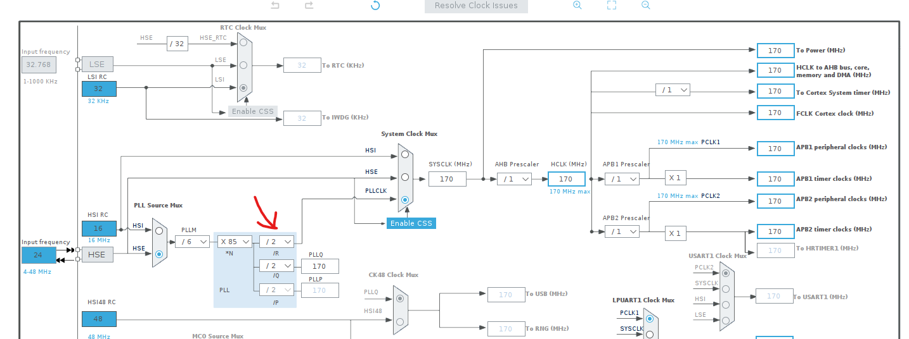

- Setting up clocks!
  - Porting over my C++ startup code
  - Had to modify some of the missing SVD fields for the STM32G4 series
    - Cloned and updated `stm32-rs/stm32-rs`'s YAML files for the g4
    - Will push upstream in a bit
    - Also had to modify the `Cargo.toml` file to point at a local version instead of referencing the `0.13.0` version of the crate. Not sure if there are any other updates beyond the released version...
    - Created [pull request](https://github.com/stm32-rs/stm32-rs/pull/528) for RCC changes
  - Needed a few additions to the `stm32-rs` FLASH peripheral as well
    - Namely, wait states
  - Okay, got everything compiling now, but something's a bit amiss
    - Expecting to be at 170MHz after the clock updates
    - According to the sysclock, I'm still locked at 16MHz
      - I set the reset to 16M and it takes 1s to clear
      - Setting to 170M clears it supafast, which means I'm still on 16MHz somehow
    - Was using the NUCLEO board, which draws power from USB
      - Switched to dev board powered by bench power supply
      - Sure enough, no current consumption change between "clock states"
    - Think I've solved it; apparently my PLLR domain wasn't actually enabled
      - It's... kind of important. Just a bit. Just a smidge.
        
      - Yup, current increases from 4mA to 7mA! :D
    - Not quite... still too fast on the systick
      - `rcc.cfgr.sws` shows `0b11`, which means it's successfully switched to PLL...
      - `PLLM` divisor is set at 6, as it should be...
      - Everything points to the CPU being at the right frequency?!
      - Setting the systick value to 170M shows that the `STK.LOAD` - or as the `cortex-m` package calls it `STK.rvr` (?) - is, uh, 22M?!
      - Oooooooooooohhhhh... apparently it's _not_ a 32 bit value: it's 24 bit. The mask for it is `0x00ffffff`
      - That means for frequencies at or above 16MHz, we need to divide the AHB bus by 8 (the only other option besides using the AHB bus directly)
    - [ID10-T error](https://en.wikipedia.org/wiki/User_error): turns out you can't actually get SysTick to tick every second at 170MHz like I was assuming you could
      - 2^24 max bits / (170MHz / 8) = 0.7895s :zany_face:
  - And done. Up and running at a full 170MHz