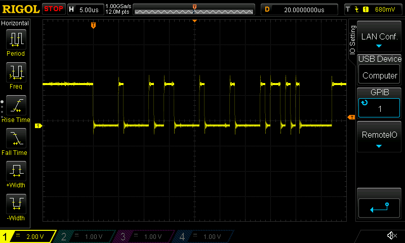

- Today's goal: send FDCAN frame!
  - Neat, just learned that `_` can be substituted for transparent type inference
    - Was trying to bit-pack a `u8` and `[u8; 3]` into a single field, 
    - Turbofish to the rescue! 
    - e.g. It's the "A type goes here, and I want you to infer it" type
    - `buffer[2] = (foo as u32) << 24 & core::mem::transmute::<_, u32>(bar);`, where `bar: &'static [u8;3]`
- Frame being transmitted!
  
  - FDCANUSB not catching it though; probably need to adjust timings or clocks a bit