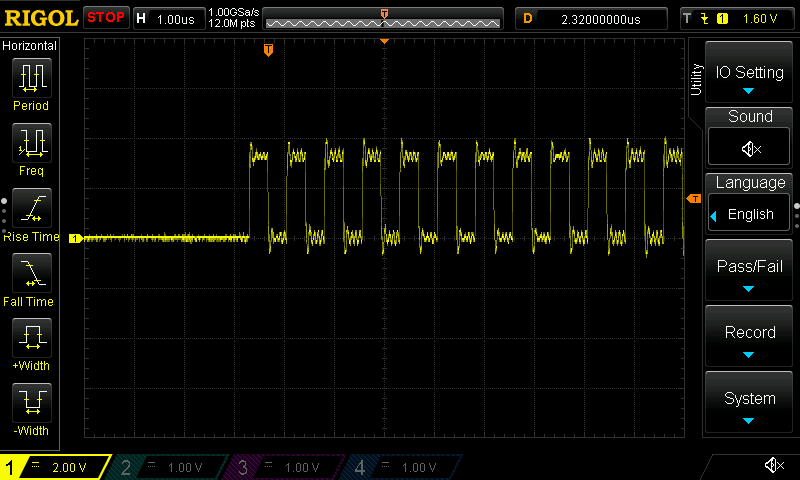
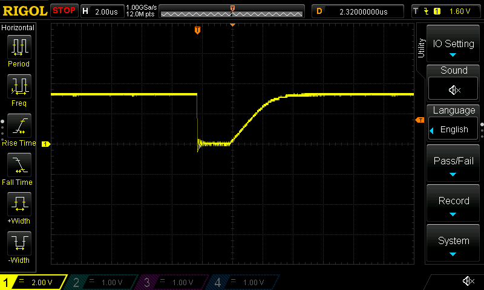
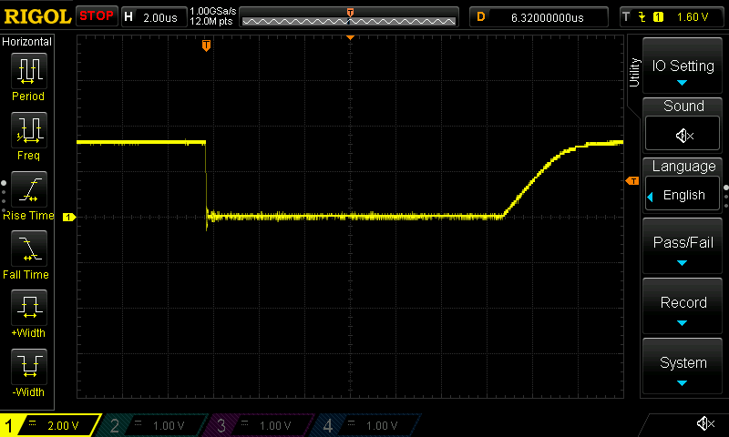
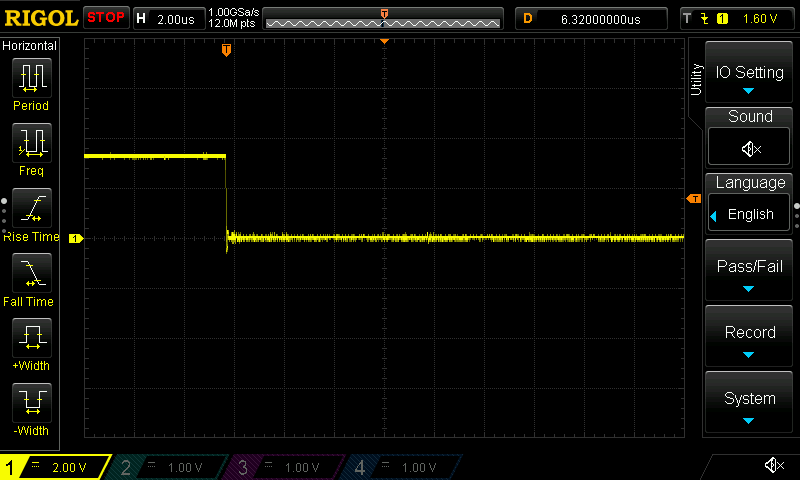
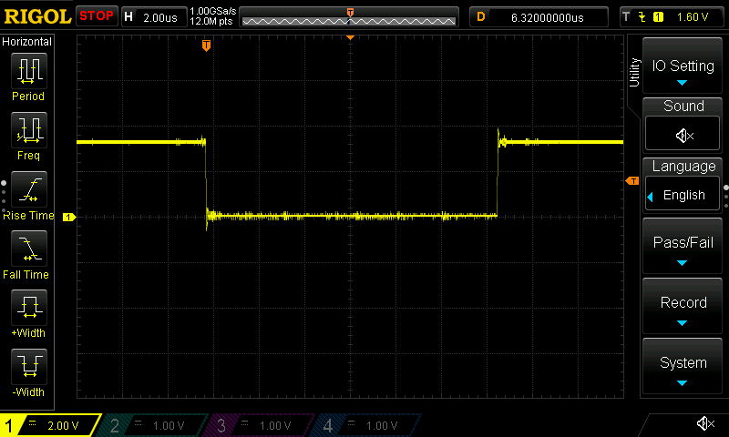

- Now that FDCAN is complete, time to get SPI communication up and running
  - Got it working surprisingly fast!
    
  - The CS line is... weird when controlled by hardware. Here it is after manually turning off the
    peripheral after the transfer is complete:
    
  - Cool, as expected, it allows the pullup on the CS line to bring it back to 3.3v. All good!
    - Oh, wait, no, that's the initial drop when the GPIO pin is configured in AF mode :sweat_smile:

    
  - There we go, much better. That's manually turning off the peripheral after the transfer is complete (busy-wait spinning on `SPI1.SR[BSY]`)
  - What happens if we complete the transfer, but _don't_ disable the peripheral?
    
    - Erm, okay, I don't really think we need to keep the external chip selected, but whatever floats your boat ST.
    - Let's try it with `SPI1.CR1[NSSP]` set to `1`, which according to the reference manual _"is used in master mode only. it allows the SPI to generate an NSS pulse between two consecutive data when doing continuous transfers. In the case of a single data transfer, it forces the NSS pin high level after the transfer."_
    
    - Wait, _WHAT?!_ This _never ever ever ever_ worked with any of the libs provided by ST, either the HAL nor the LL. Apparently the hardware-driven CS ... does work?
    - Woot, I guess? /shamecube.gif One less thing to worry about when mucking with the peripherals
    - Hm, I wonder if it
