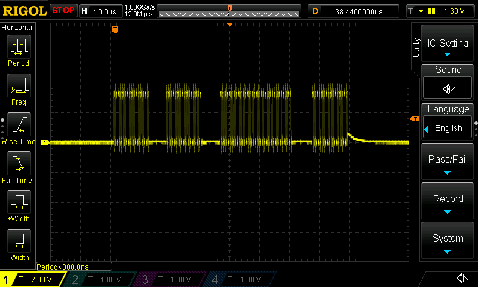
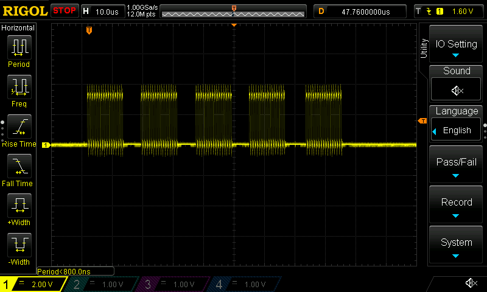

- Today's goal: finish DRV8323RS registers and get configuration set up for ADV control timers
  - Maybe that was a biiiit to optimistic. Turns out the DRV8323 has a _lot_ of enum valiues for calibration...
    - Maybe someday I can convince TI to release Rust libraries...
      - [In my dreams...]
  - So looks like we can read registers fine, but writing doesn't seem to be enabling the SPI or actually writing anything
  - Okay, now that the SPI is being enabled/disabled in the `update()` call... :musical_note: which one of these, is not like the others? :musical_note:

    
    - That's a 32 bit write... wat?
    - I'm guessing I'm either double-writing the DR register, or not clearing out the DR on read properly. Gotta check the SPI peripheral's FIFO
    - ...Also seeing a strange "You may have requested too many hardware breakpoints/watchpoints"?
      - Maybe my OpenOCD config is requesting a bunch or something? I only have three...
      - AFAICT it adds breakpoints to muliple places in the Rust code if there are closures, instead of the first occurrence. Might want to file a bug on that
  - Ah, there we go:

    
    - Wasn't waiting for the `bsy()` signal during writing
    - I wonder if there isn't a Rust-y way to deal with that
      - Maybe a TypeState pattern, like "Wrote `dr`, unable to do anything else until we block and `bsy` is clear"?
      - Wait, maybe SPI should have a `blocking_read()` typestate change? It's not necessarily relevant to the DRV8323 chip
