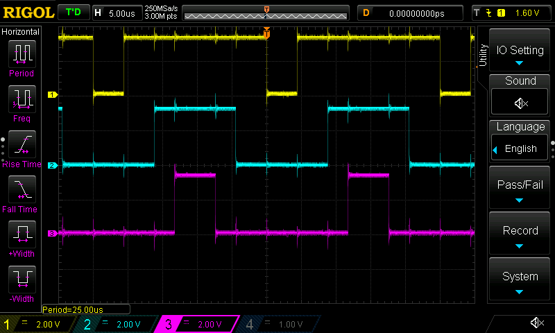
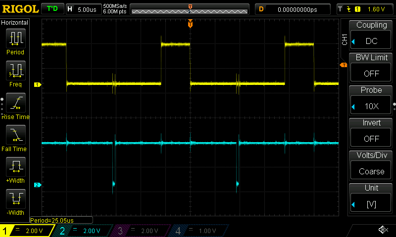
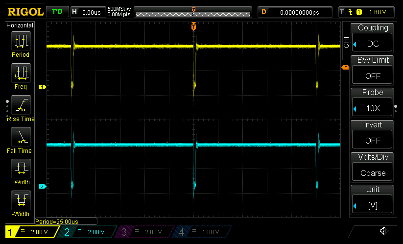

Spinning up Tim1 for 3-phase with enforced deadtime.
- Looks like it's up and running (`CNT` is spinning) but I'm not seeing anything on the output pins
  - Pins are PA[8910]
  - AF mode: check
  - Output type PushPull: check
  - Speed very high: check
  - Floating: check
  - Alternate function 6: check
- Probably a setting in Tim1 that's not set then...
  - CC channels enabled: check
  - PWM mode: check
- Oh, wait, it's probably the 3-phase deadtime PWM setting. Ayup, that's it: disabling the 3-phase
  AND on channel 5 gets PWMs like we'd expect
  
- And all systems go on hardware-enforced deadtime! The PWM traces are now logical ANDed with TIM1
  ch5. Top trace is a typical ~24% trace. It's AND'd with ch5 (cyan). In this case, doesn't really
  matter much; the deadtime is enforced during the low phase of the PWM.
  
- Now if we set the timer channel to 100% duty cycle, it's AND'd with the tim5 channel at 98%, which
  results in the output PWM being "clamped" to 98% duty cycle
  
