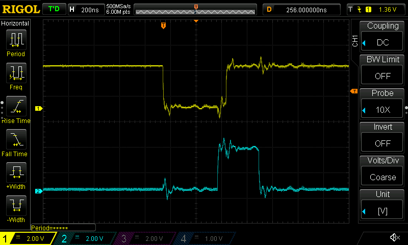
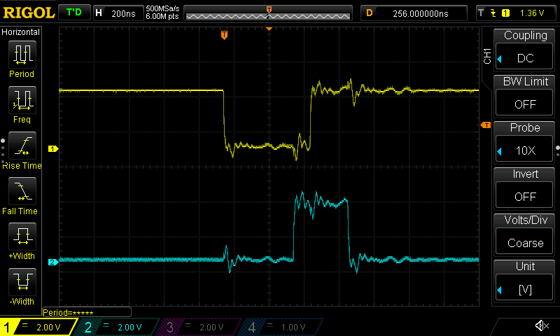
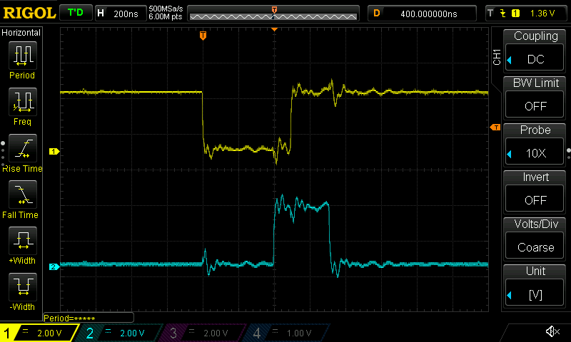

Spinning up Tim1 for 3-phase with enforced deadtime.
- Looks like it's up and running (`CNT` is spinning) but I'm not seeing anything on the output pins
  - Pins are PA[8910]
  - AF mode: check
  - Output type PushPull: check
  - Speed very high: check
  - Floating: check
  - Alternate function 6: check
- Probably a setting in Tim1 that's not set then...
  - CC channels enabled: check
  - PWM mode: check
- Oh, wait, it's probably the 3-phase deadtime PWM setting. Ayup, that's it: disabling the 3-phase
  AND on channel 5 gets PWMs like we'd expect
  
  - Turns out the PWM mode wasn't set for ch5; it was defaulting to "frozen" status
- And all systems go on hardware-enforced deadtime! The PWM traces are now logical ANDed with TIM1
  ch5. Top trace is a typical ~24% trace. It's AND'd with ch5 (cyan). In this case, doesn't really
  matter much; the deadtime is enforced during the low phase of the PWM.
  
- Now if we set the timer channel to 100% duty cycle, it's AND'd with the tim5 channel at 98%, which
  results in the output PWM being "clamped" to 98% duty cycle
  

Next: get the tim1 update trigger to cause an interrupt
- So it works... but seeing some interesting latency'
  
  - That's the PWM dead zone centered around INH_A's off PWM start
  - The start of the timer loop itself should be right smack in the middle of that yellow trace;
    it's hardware generated aka no software overhead
  - The weird part is that the cyan trace is bit-banging a GPIOB pin
  - From the roughly center of the hardware PWM trace - where I expect the Update interrupt is
    triggered- there's about ~165ns of latency between the interrupt triggering and the pin toggling
  - Assuming the pin can be toggled "immediately", that's 12 cycles to enter the ISR + 3 to load and
    set the `BSRR` register
  - With that assumption, that's ~88ns. Though that _does_ include a `device::Peripheral::steal()`
    and a "zero overhead" write to the register
  - I wonder if I can just slam a bit into the `BSRR` register and see what the latency is
- Whelp, best case scenario: about 125ns?
  
  - That's writing the register directly; unsafe code, no Tust, no nothin'
  - 300ns over what the disassembly shows is... 13 instructions? Maybe 15?
    
  - Only thing I can think of is that it's flash and not CCM...?
  - Still not a terrible latency overall. Will have to experiment with CCM interrupt handlers.
  - The main goal of this whole process was to try to get a sense of the latency between when an
    update is fired and when I can first see something on the
