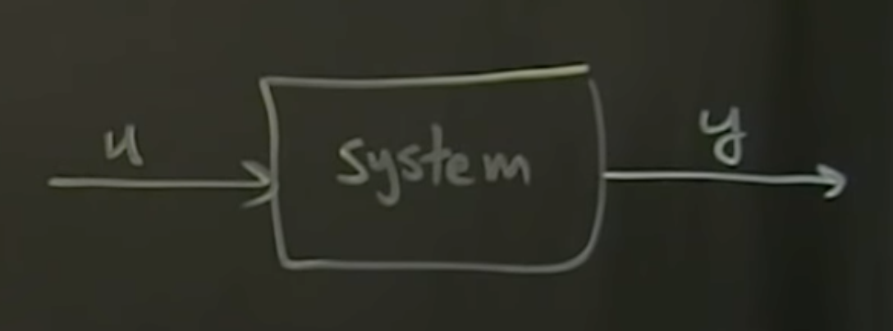

Been a while ;)

First, gonna dive into control theory with [Control Bootcamp](https://www.youtube.com/playlist?list=PLMrJAkhIeNNR20Mz-VpzgfQs5zrYi085m), courtesy of MrCruz@odrive

- Multiple types of "control"
  - Passive vs Active
  - Active: Open loop
    - `System` has input `u`, output `y`: `u > system > y`

      

    - Inverts flow, saying what `u` do I need to apply to get desired `y`
    - Example: inverted pendulum. `u` is vertical freq, `y` is angle
  - Active: Closed loop

Going over ["Teaching Old Motors New Tricks" - Part 1](https://www.youtube.com/watch?v=fpTvZlnrsP0)
