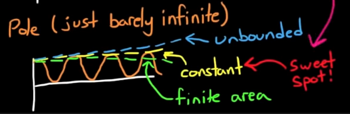

Some quick notes from [Brian Douglas'](https://www.youtube.com/channel/UCq0imsn84ShAe9PBOFnoIrg)
series on Control Systems

## Common Laplacian transforms

From [transfer functions](https://www.youtube.com/watch?v=oBc_BHxw78s&list=PLUMWjy5jgHK1NC52DXXrriwihVrYZKqjk)

- "Convolution integral" in time space
  - Input $u(t)$ and impuse response $g(t)$, then the output is the convolution of $u(t)$ and $g(t)$: $u(t)\star g(t)$
  - $y(t) = \int_0^tu(\tau)g(t-\tau)d\tau$
- "Convolution integral" in $s$ space (laplacian)
  - Input $u(s)$ and impuse response $G(s)$, then the output is: $Y(s)=u(s)G(s)$
  - $G(s)$ is the **transfer function**
    - The laplacian of the impulse response

Spring cart system

- $m\ddot{x}(t)+kx(t)=u(t)=\delta(t)$
  - $\delta(t)$ is Dirac, aka an impulse
- Solve using Laplacian
  - $m(S^2x(s) - sx(0) - x'(0))$
  - No initial conditions, so $sx(0) - x'(0))$ are $0$
  - $ms^2x(s) + kx(s) = 1$
- Solve for $x(s)$
  - $x(s)=\frac{1}{ms^2+k}$
- In time domain? Inverse laplacian $\mathcal{L}^{-1|}\left(x(s)\right)=\frac{1}{\sqrt{km}}sin\left(\sqrt{\frac{k}{m}}t\right)$
- What if it's a ramp function instead of an impulse? $u(t)=t$?
  - Time domain: convolve with impulse $t\star\frac{1}{\sqrt{km}}sin\left(\sqrt{\frac{k}{m}}t\right)$
    - Difficult
  - $\mathcal{L}\left(u(t)\right)=\frac{1}{s^2}$
    - So result is impulse func times input: $\frac{1}{s^2}\left(\frac{1}{ms^2+k}\right)$
- Key point: $\left(\frac{1}{ms^2+k}\right)$ is the **transfer function**

Combining transfer functions is as simple as multiplying them together in the $s$ domain

## Laplacian transform

Neat: for differential equations, any solution must be either:
1) Exponential: $e^{at} \rArr\frac{da^{at}}{dt}=ae^{at}$
1) Sinusoids: $sin(at)\rArr\frac{d^2sin(At)}{dt^2}=-a^2sin(at)$
- Solutions **must** contain:
  - $e^{-j\omega t}$ or $e^{at}$
- Fourier transform: $X(\omega)=\int_{-\infty}^{\infty}x(t)e^{-j\omega t}dt$
  - Key point: $x(t)e^{-j\omega t}$ are sinusoids

After Fourier, multiply by exponential:

- $x(\sigma,\omega)=\int_{-\infty}^{\infty}\left[x(t)\cdot e^{-\sigma t}\right]e^{-j\omega t}dt$
  - Combine exponential terms: $e^{-\sigma t}\cdot e^{-j\omega t}=e^{\left(-\sigma - j\omega\right) t}$
- ***KEY POINT***: now $s=\sigma+j\omega$
  - complex: real part is $\sigma$, and imaginary $\omega$
  - real part corresponds to exponential responses, and imaginary that corresponds to sinusoidal \

    
- And substituting ing gives us $X(s)=\int_{-\infty}^{\infty}x(t)e^{-st}dt$
  - Moves from time domain ($t$) to $s$ domain

- Key point: Transfer functions are $\frac{zeros}{poles}$
