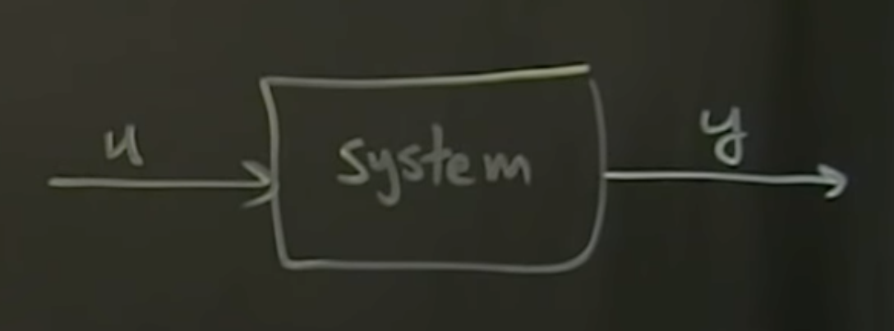
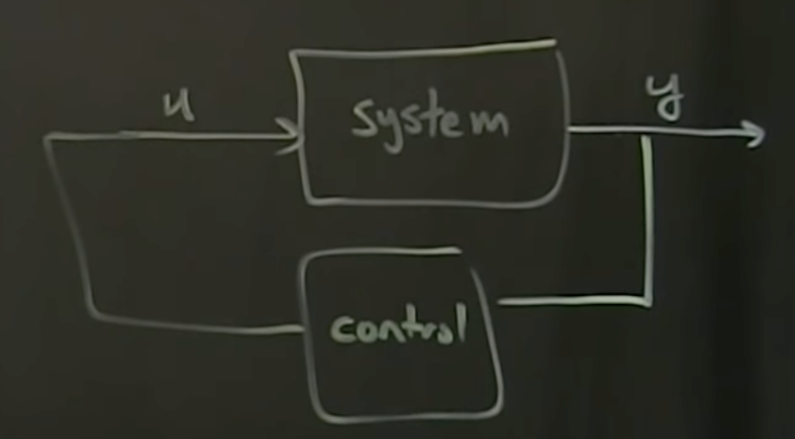
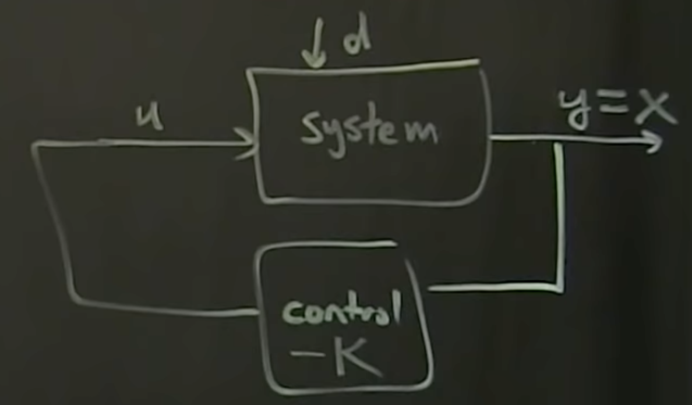

Been a while ;)

First, gonna dive into control theory with [Control Bootcamp](https://www.youtube.com/playlist?list=PLMrJAkhIeNNR20Mz-VpzgfQs5zrYi085m), courtesy of MrCruz@odrive
# [Episode 1](https://www.youtube.com/watch?v=Pi7l8mMjYVE&list=PLMrJAkhIeNNR20Mz-VpzgfQs5zrYi085m&index=1)
- Multiple types of "control"
  - Passive vs Active
  - Passive: optimizing system during design (optimizing airflow over fairings, etc)
  - Active: Open loop
    - `System` has input `u`, output `y`: `u > system > y`

      
    - Inverts flow, saying what `u` do I need to apply to get desired `y`
      - Example: inverted pendulum. `u` is vertical freq, `y` is angle
    - Downside: always putting in energy via `u`
  - Active: Closed loop feedback control
    - Sensor measurements of output read by controller, put back into system via `u`

      
    - Can minimize energy input by measuring output
- Why feedback?
  1. Uncertainty
  1. Instability: internal influences
  1. Disturbances: external influences (`d` input to system)
  1. Efficiency
- Instability
  - $\dot{x}$ - quantities of interest in model
    -  XYZ and YPR
    -  Angle of pendulum
    -  Rotation vector and derivatives
-  Starting with linear system of equations: $\dot{x} = Ax$
  - ODE Solution: $x(t) = e^{At}x(0)$
  - If $A$ has any eigenvalues with a positive _real_ part then the system will be unstable
    - Iff all real parts of eigenvalues are negative then it goes to zero/stabilizes
  - Control theory adds $+Bu$, for $x(t)=e^{At}x(0) + Bu$
    - Ability to actuate - "control knob"
    - $B$ is tall/set of vectors same height as $x$
  - Future extension: measure limited set of aspects of system $y=Cx$
- Posit: basic control law $u$ is going to be some matrix $K$ times state $x$
  - $u = -Kx$
  - 
  - Plugging in: $\dot{x}=Ax - BKx$
    - $K$ is "transpose" size of $B$,
    - $BK$ is a matrix of size $NxM$ if $x$ is an $N$-dimensional state
  - Rearranging: $\dot{x}=(A-BK)x$
    - Notice by measuring state and feeding back into $u$, the above is effectively the same as
      $\dot{x}=Ax$, but with a modified system of linear equations for $A$
    - The eigenvalues of $(A-BK)$ are what tell you whether a system is going to be unstable or not
    - Because we're measuring $x$, we can change the

[side note: VSCode Setting Sync was a bit of a bear to get set up, but it's an incredible time saver]

Going over ["Teaching Old Motors New Tricks" - Part 1](https://www.youtube.com/watch?v=fpTvZlnrsP0)
