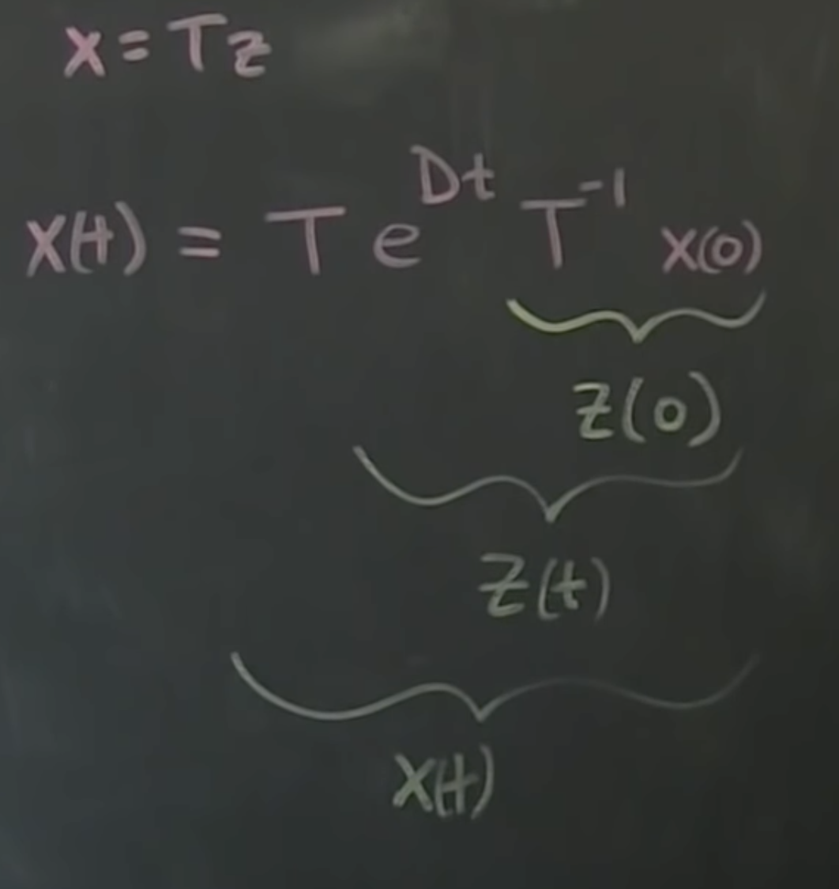

  Starting [part
02](https://www.youtube.com/watch?v=nyqJJdhReiA&list=PLMrJAkhIeNNR20Mz-VpzgfQs5zrYi085m&index=2)

Content:
1. How do you convert potentially non-linear systems (pendulum) into a linear system of $\dot{x}=Ax$
1. Eigenvalues and eigenvectors and what they mean physically
1. Write down discrete time version
1. If you add "control" $+Bu$, how do we control this?
1. Some actuators and controllers are not controllable, so easy test

## Eigenvalue decomposition of control systems
$\dot{x}=Ax$
- $x\isin\real^n$ is a vector
- $A$ is a matrix that tells how these variables interact with each other
  -  Time rate of change of state x depends on state x
-  Basic solution: $x(t)=e^{At}x(0)$
  -  How do you take the exponential of a matrix?
  -  Use Taylor series, e.g. $1 + x + \frac{x^2}{2!} + \frac{x^3}{3!}+...$
  -  $e^{At} = I + At + \frac{A^2t^2}{2!} + \frac{A^3t^3}{3!}+...$
    -  Not easiest thing to compute... need different formulation
    -  Use Eigenvalues + eigenvectors to get coordinate system transform.
-  **Use EVec and EVal**
  -  EVec/EVal satisfies $A\xi=\lambda\xi$
    -  Matrix $A$ times vector $\xi$ is just some scale (constant) $\lambda$ times $\xi$

### _Pause_

_Okay wow that got mathy fast - not a bad thing! :sweat_smile: - and this is one of the rare cases
where writing is actually FASTER than typing, since my LaTex math is pretty "meh". Copying notes
now..._

### _Resume_
- ...
  - If you multiply $\xi$ (eigenvector) by $A$, it's still effectively pointing in the same direction,
    just scaled
    - Can be inverted of course
    - Effectively just gets scaled by $A$
  - $T=\begin{vmatrix} \xi_1 & \xi_2 & \xi_3 ... & \xi_n \end{vmatrix}$
    - Again, $\xi$ is matrix of eigenvectors
  - $D=\begin{vmatrix}
  \lambda_1 & 0 & 0 & ... & 0 \\
  0 & \lambda_2 & 0 & ... & 0 \\
  0 & 0 & \lambda_3 & ... & 0 \\
  0 & 0 & 0 & ... & \lambda_n
  \end{vmatrix}$
    - Diagonal matrix means every eigenvalue is independent; easy computation
    - Note: doesn't have to be diagonal;
      - Can have "Generalized" eigenvectors
      - Can have "jordan block form"
- So why go through all this?
  -  We're now working in a new coordinate system
  -  Advantage: since it's still linear, instead of $x_1, x_2, x_3, ... x_n$, we can choose any
     linear combination of any of inputs
  - $x=Tz$
    - $z$ are inputs in eigenvector directions
    - Using $z$ always makes things eaiser
  - $\dot{x}=T\dot{z}=Ax$
  - $T\dot{z}=ATz$
  - $\dot{z}=T^{-1}ATz$
    - But note: $AT=TD$ can be written as $T^{-1}AT=D$
    - _Which means $T^{-1}ATz$ is effectifly just $D$!_
----------
# $\dot{z}=Dz$

- That's huge!
  - Components of $z$ are completely independent
- $
\frac{d}{dt}\begin{vmatrix}
 z_1\\
 z_2\\
 ...\\
 z_n
\end{vmatrix} = \begin{vmatrix}
\lambda_1\\
 & \lambda_2 \\
 & & & \lambda_n
\end{vmatrix}
\begin{vmatrix}
 z_1\\
 z_2\\
 ...\\
 z_n
\end{vmatrix}
$
  - Simply multiply by eigenvalues to get derivative
- Solution: $z(t) = e^{DT}z(0)$
  - $z(t) = \begin{vmatrix}
e^{x_1t}\\
& e^{x_2t}\\
& & \ddots & \\
& & & e^{x_nt}  \\
  \end{vmatrix}z(0)$
- Takeaway: can get state of system at any future time $t$ by simple calculation of $e^{x_nt}$ in
  eigen dims/coords

## So, how do we map between physical coordinate systems and eigen?

- $A=TDT^{-1|}$
  - Again, from $AT=TD$
  - Allows us to simplify the Taylor series $e^{At} = I + At + \frac{A^2t^2}{2!} + \frac{A^3t^3}{3!}+...$
- $e^{At} = TT^{-1} + TDT^{-1}t + \frac{TDT^{-1}TDT^{-1}t^2}{2!} + ...$
  - _With $I=TT^{-1}$ and $A=TDT^{-1}$_
  - But we see $TT^{-1}$, which is just $I$
  - $e^{At} = TT^{-1} + TDT^{-1}t + \frac{TDDT^{-1}t^2}{2!} + ...$
  - $e^{At} = TT^{-1} + TDT^{-1}t + \frac{TD^{2}T^{-1}t^2}{2!} + ...$
  - Now we have $T$ on left and $T^{-1}$ on the right
  - Break 'em out and we've got $e^{At} = T\begin{bmatrix}
    \frac{D^{2}t^2}{2!} + ...
  \end{bmatrix}T^{-1}$
- Now here comes the sneaky bit: _undo_ the Taylor expansion: $e^{At} = T\begin{bmatrix}
    e^{Dt}
  \end{bmatrix}T^{-1}$
  - $e^{Dt}$ is **easy to compute**!
  - It's only a diagonal matrix, and that diagonal is only scalar values!

## Okay, so how do we get convert to/from physical coordinates?

- Start back with $x(t)=e^{At}x(0)$
- $x(0)$ is just the initial conditions
  - In inverted pendulum that's just angle and velocity of pendulum
- $x(t)=Te^{Dt}T^{-1}x(0)$
  - But $T$ is just a matrix of eigenvectors
- Since $x=Tz$, we can get the initial conditions in terms of $z$ with $T^{-1}=x(0)=z(0)$
  - Now we've got initial conditions, just in $z$-space!
  - "special eigenvector coordinates"
  - $z$-space dynamics are simple and decoupled
- Now we're at $x(t)=Te^{Dt}z(0)$
  - Still have a weird conversion from $z$-space to $x$-space
  - But from above we have $z(t) = e^{DT}z(0)$ !!
- $x(t)=Tz(t)$
  - Easy to advance initial conditions in eigen space forward in time
  - Multiplying $z(t)$ by $T$ converts it back from eigen space to physical space

## **TL;DR:** We can calculate in eigen space which is much simpler, and can move back into physical space
