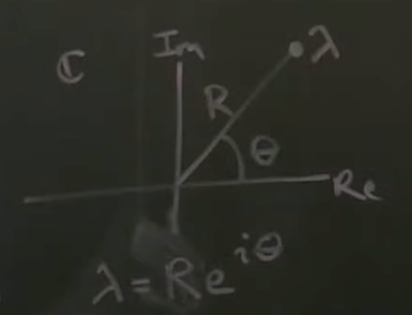

Onwards to [part
3](https://www.youtube.com/watch?v=h7nJ6ZL4Lf0&list=PLMrJAkhIeNNR20Mz-VpzgfQs5zrYi085m&index=3):
Stability and eigenvalues

Refresher: $[T,D]=eig(A)$

## Continuous time
- Stability - that is, as $t$ approaches $\infin$ - has to do with $e^{Dt}$
  - Again, refresher: $e^{Dt}=\begin{vmatrix}
  e^{\lambda_1t}\\
  & e^{\lambda_2t}\\
  & & e^{\lambda_3t}\\
  & & & \ddots\\
  & & & & e^{\lambda_nt}
  \end{vmatrix}$
  - And in continuous space $\lambda=a+ib$
- Using euler's formula, we get $e^{\lambda t}=e^{at}\begin{bmatrix}
    cos(bt) + i sin(bt)
  \end{bmatrix}$
  - If $A$ is real and $x$ is real in $\dot{x}=Ax$, where do the imaginary numbers come from?
    - In instances where A ever had eigenvalues with an actual imaginary part, the equation could be
      modified to have a $\plusmn$ pair: $e^{\plusmn\lambda t}=e^{at}\begin{bmatrix}
      cos(bt) \plusmn i sin(bt)
    \end{bmatrix}$
    - For physical and mathematical systems, the solution means that the imaginary parts cancel out
  - Note that $\begin{bmatrix}
    cos(bt) + i sin(bt)
  \end{bmatrix}$ is always <= 1
  - That means the only part that could possibly explode is the $e^{at}$ part!
  - Thus if $a < 0$, the system collapses to stability, and if $a > 0$ the system expands uncontrollably
- Take home: **if and only if all real parts of $\lambda$ are negative, the system is stable**
- A good way to think about eigenvalues is that they live in the complex plane, aka $\lambda\isin\Complex$
 - 
- Goal of control theory and systems is if $A$ in the eqn $\dot{x}=Ax$ is unsable, _it can be made
  stable with $+ Bu$_
  - In other words, we use the controller's $Bu$ to drive the positive real values in any
    eigenvectors towards the negative to induce stability

## Discrete time
- In continuous time, %\dot{x}% is _continuously varying_ $x(t)$, but physical systems use discrete
  time $\Delta t$
- "Dynamical system" $x_{k+1}=\tilde{A}x_k$
  - Each step can be calculated by the previous step by applying $\tilde{A}$
    - _Side note: suddenly the math used in my thesis makes sense_ :zany_face:
  - Initial condition $x_0$
  - **IMPORTANT**: Link between discrete $\tilde{A}$ and continuous $A$ is $\tilde{A}=e^{A\Delta t}$
  - Also, remember: $A$ is not in eigen space; it's in real physical coordinate space prior to
    applying eigen transformation
- $x_1=\tilde{A}x_0$, $x_2=\tilde{A}^2x_0$, $x_3=\tilde{A}^3x_0$ ... $x_n=\tilde{A}^nx_0$
  - If we write this in terms of eigenvalues and eigenvectors using $A=TDT^{-1}$, the only thing
    that increases exponentially is $D$, aka the eigenvalue matrix of $A$
    - Remember: $T$ is eigenvector transform matrix :)
  - aka $\lambda$, $\lambda^2$, $\lambda^3$, ... $\lambda^n$ above, respectively
  - Implies that the radius of the eigenvector decays... wait, radius?
- Neat trick: in discrete space, think of the eigenvector in terms of radius $R$ and angle $\theta$
  - $\lambda=Re^{it}$
  - 
    - Applying euler again, $\lambda=R\begin{bmatrix}cos(\theta)+isin(\theta)\end{bmatrix}$
    - Now for time step $n$, we need to exponentiate $\lambda^{n}$, which results in $\lambda^{n}=R^ne^{in\theta}$
    - The only thing that can explode is $R^{n}$
  - For stable systems not to blow up with $\lambda^n$, the radius $R$ has to be <= 1
    - (The theta just swings around and around)
  - 
- The same eigenvector decomposition still applies in discrete time: $\tilde{A}=T\tilde{D}T^{-1}$

## Take-home

- We can map to/from discrete time via $\tilde{A}=e^{A\Delta t}$.
- In continous time, systems are stable if the real component of $\lambda$ is $<0$
- In discrete time, system is stable if $R < 1$ (real component of eigenvalues of $\tilde{A}$)
