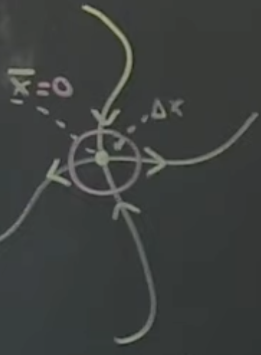
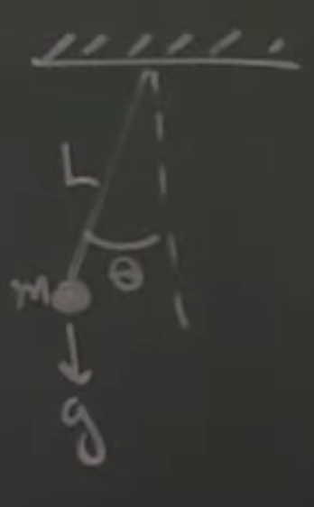

Time for [part
4](https://www.youtube.com/watch?v=1YMTkELi3tE&list=PLMrJAkhIeNNR20Mz-VpzgfQs5zrYi085m&index=4):
linearizing around a fixed point

Keeping in mind: $\dot{x}=Ax$

- Going to be diving into linearizing non-linear systems, at least at certain local points
- Goal: convert nonlinear/any to linear, i.e. $\dot{x}=f(x) \Rightarrow \dot{x}=Ax$
  1. Find the "fixed points" of the system
    - $\bar{x}$ such that $f(\bar{x})=0$
    - Stable, non-moving/changing parts of the system: $\frac{d}{dt}f(x) = 0$
      - Pendulum system: fully downwards or fully inverted; stable
      - Sun & earth astronomy system: point where the gravity of earth == gravity of sun
    - Note: these fixed points can be unstable. A nudge in any direction can cause instability (up
      position of inverted pendulum)
  2. Linearize about $\bar{x}$
- Linearize locally via $\frac{Df}{Dx}\Big\rvert_{\bar{x}}$, or $\frac{Df}{Dx}$ evaluated at $\bar{x}$
  - $\frac{Df}{Dx}$ is a matrix of partial derivatives, also known as Jacobian
  - Example: $\dot{x}_1 = f_1(x_1, x_2) = x_1x_2$, $\dot{x}_2 = f_2(x_1, x_2) = x_1^2+x_2^2$
    - $\frac{Df}{Dx}=\begin{vmatrix}
      \frac{df_1}{dx_1} & \frac{df_1}{dx_2} \\
      \frac{df_2}{dx_1} & \frac{df_2}{dx_2}
    \end{vmatrix}$
    - $=\begin{vmatrix}
      x_2 & x_1 \\
      2x_1 & 2x_2
    \end{vmatrix}$
    - Now, evaluate at $\bar{x}$, inserting fixed point
    - $\frac{Df}{Dx}\Big\rvert_{\bar{x}}=\begin{vmatrix}
      \frac{df_i}{dx_j}
    \end{vmatrix}$
      - Formal definition of jacobian
- Linearization rests on the Taylor approximation of $f$ about $\bar{x}$, but veeery local
  - 
    - $\Delta x$ is very small
    - Simplification: change origin to $\bar{x}$
  - Now apply Taylor series to $\dot{x}=f(x)$ about $\bar{x}$
  - $=f(\bar{x}) + \frac{Df}{Dx}\Big\rvert_{\bar{x}}(x-\bar{x}) +
    \frac{D^2f}{D^2x}\Big\rvert_{\bar{x}}(x-\bar{x})^2 + ...$
  - Because we're only concerned with small values of $\bar{x}$, the squared-and-later terms
    contribute less and less to the equation
  - Given $f(\bar{x})=0$, we can rewrite it as $\dot{x}=0 +
    \frac{Df}{Dx}\Big\rvert_{\bar{x}}(x-\bar{x}) + tiny + very\_tiny + very\_very\_tiny + ...$
  - Conclusion: $\Delta\dot{x}=\frac{Df}{Dx}\Big\rvert_{\bar{x}}\Delta x
    \Rightarrow\Delta\dot{x}=A\Delta x \Rightarrow \dot{x}=Ax$, just like we wanted: a linear
    system!
- Beauty of contol: adding $+ Bu$ keeps the system close to a stable point, even in unstable systems
  like inverted pendulum
  - Caveat: linearization doesn't always characterize the dynamics of the entire system
  - Refer to [Hartman-Grobman](https://en.wikipedia.org/wiki/Hartman%E2%80%93Grobman_theorem) theorem
    - If the eigenvalues around a fixed point is hyperbolic - all eigenvalues have a nonzero real
      part - then the linearized system does describe the system well around that point
    - If the eigenvalues are purely imaginary, doesn't necessarily descrive it well locally
      - $very\_tiny$ terms can come into play
      - Note: doesn't _necessarily_ mean that the system is unstable; inverted pendulums at $\theta=0$ are
        described well

## Example: Pendulum

- Start with the physical equation of motion: $\ddot{\theta}=-\frac{g}{L}sin(\theta) - \delta\theta$
  - $\delta\theta$ is friction, aka damping term
  - Obviously non-linear
  - Two fixed points: "down" at $\theta=0$, and "up" at $\theta=\pi$
- Thinking about the physical system, poking pendulum induces an oscillation, which means there's
  probably an $i$ term in the eigenvectors, and at least for the down state the system is stable, so
  the real parts of the eigenvectors are probably $<0$
  - Note: we're looking at a _continuous time_ system here, not discrete; we expect the real parts
    to be $<0$, not $R<1$ like from discrete time
- Start with state space system $\dot{x}=f(x)$
  - $\begin{bmatrix}x_1\\x_2\end{bmatrix}=\begin{bmatrix}\theta\\\dot{\theta}\end{bmatrix}$
    - Keep in mind that $\frac{d}{dt}\theta=\dot{\theta}$
  - Going to apply simplification that $\frac{g}{L}=1$, for brevity
$$\frac{d}{dt}\begin{bmatrix}
    x_1\\
    x_2
\end{bmatrix}=\frac{d}{dt}\begin{bmatrix}
  \theta\\
  \dot{\theta}
\end{bmatrix}=\begin{bmatrix}
  \frac{d}{dt}\theta\\
  \frac{d}{dt}\dot{\theta}
\end{bmatrix}=\begin{bmatrix}
  \dot{\theta}\\
  \ddot{\theta}
\end{bmatrix}=\begin{bmatrix}
  x_2\\
  -sin(x_1)-\delta x_2
\end{bmatrix}$$
- Step 1: find fixed points
  - $\bar{x}_{down}=\begin{bmatrix}0\\0\end{bmatrix}$, $\bar{x}_{up}=\begin{bmatrix}\pi\\0\end{bmatrix}$
  - Note that $x_2$ has to be $0$
- Step 2: linearize
  - $\frac{Df}{Dx}\Big\rvert_{\bar{x}}=\begin{bmatrix}0 & 1 \\ -cos(x_1) & -\delta\end{bmatrix}$
    - Surprise! It's the Jacobian!
  - Plug in $\bar{x}_{down}$: $\frac{Df}{Dx}\Big\rvert_{\bar{x}_{down}}=\begin{bmatrix}0 & 1 \\ -1 & -\delta\end{bmatrix}$
    - Find eigenvalues, results in $\lambda^2+1=0$, or $\lambda^2=-1 \Rightarrow \lambda=\plusmn i$
      - Eivenvalues are only imaginary (no reals), so approximation may not hold here; turns out it
        does, but just be aware
    - Note that in this case we kind of ignored damping. If you set $\delta$ to nonzero value, turns
      out eigenvectors are something like $\lambda=tiny\_value \plusmn i$
  - Similar process for $\bar{x}_{up}$: $\begin{bmatrix}0 & 1\\1 & -\delta\end{bmatrix}$
    - Eigenvalues are $\lambda=\plusmn1$
    - There's at least one positive eigenvalue, which means the system is unstable
      - Grows as $e^{\lambda t} = e^{1 t}$, which is asymptotic
    - Makes sense, physically; if an inverted pendulum is static (read: at fixe point) and it's
      given a tiny bump, it's no longer stable.
