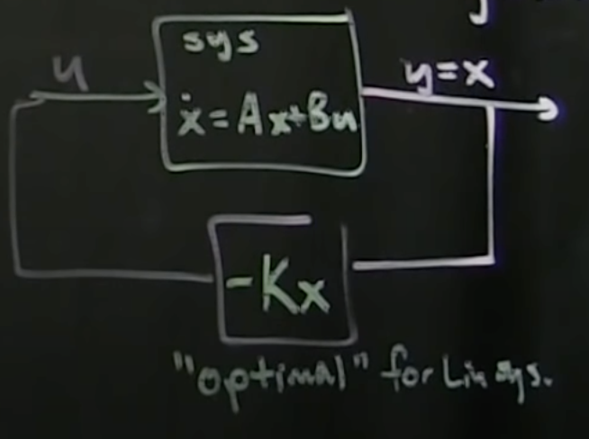

And here comes the [controllability in part
5!](https://www.youtube.com/watch?v=1YMTkELi3tE&list=PLMrJAkhIeNNR20Mz-VpzgfQs5zrYi085m&index=5)

## Recappin'

- $\dot{x}=Ax + Bu$
  - Adding control part: $Bu$
  - $u$ is a vector $u\isin\Reals^q$ for $q$ different inputs
  - $A\isin\Reals^{n\times m}$
    - Again, $A$ are eigenvectors + eigenvalues of x
    - $A=TDT^{-1}$, where $D$ are eigenvalues and $T$ are eigenvectors
  - $B\isin\Reals^{n\times q}$
  - $y\isin\Reals^p$
    - $y$ is sensor inputs
    - $y=Cx$
  - 
- Can think of $u$ as "control knobs" for the system; the control surfaces/inputs you have to the
  system
  - $u=-Kx$ if system is controllable
- $\dot{x}=Ax - BKx$
- $\dot{x}=(A-BK)x$
  - This means we can use K to drive eigenvalues to whatever we want

## Controllability

- If $u=Kx$, can place eigenvalues anywhere with a good choice of $K$
- With the right manipulation of $u$, we can steer $x$ to anywhere in the state space $\Reals^n$

## When and how to test

- What do we have access to to determine controllability?
- Often when doing control theory, we're given an existing design and asked "Is this controllable?"
  - i.e. we're given $\dot{x}=Ax$
  - $A$ isn't modifiable
    - $A$ is "pre-built"
  - Falls on $+ Bu$ for control
- Depending on design, may be able to choose $B$
  - Example: $B$ is a set of ailerons/elevators/flaps on a plane; use them to control flight
  - $B$ is effectively all control surfaces that affect dynamics and stae
- TL;DR: can be handed $A$ and $B$, and need to determine if system is truly controllable or not
- Easy test: Matlab's `ctrb(A,B)`

## Simple example of (UN)controllability

1. $\begin{bmatrix}\dot{x_1}\\\dot{x_2}\end{bmatrix}=\begin{bmatrix}1 & 0\\0 & 2\end{bmatrix}\begin{bmatrix}x_1\\x_2\end{bmatrix}$
    - $\begin{bmatrix}1 & 0\\0 & 2\end{bmatrix}$ is $A$ matrix
2. Add control: $\begin{bmatrix}\dot{x_1}\\\dot{x_2}\end{bmatrix}=\begin{bmatrix}1 & 0\\0 & 2\end{bmatrix}\begin{bmatrix}x_1\\x_2\end{bmatrix} + \begin{bmatrix}0\\1\end{bmatrix}u$
    - In this case $\begin{bmatrix}0\\1\end{bmatrix}$ is $B$ matrix
- $x_1$ is uncontrollable, due to the $0$ in the top position of $B$
  - Allows control of $x_2$ due to $B$, but not $x_1$
- Note: assuming we had an additional mode of control, we could append it as another column of $B$
  - e.g. if $B=\begin{bmatrix}1&0\\0&1\end{bmatrix}$, that would give us full _independent_ control
    of both $x_1$ and $x_2$
  - Would give us more "control authority"; more _knobs_
  - It's akin to adding more actuators
  - Each new column is a new _knob_/actuator
  -

## Simple example of dependent controllability

- Depending on $A$, even with a $B$ matrix like $\begin{bmatrix}0\\1\end{bmatrix}$ there can be control
  - Not independent, but _can_ be controlled
- $\begin{bmatrix}\dot{x_1}\\\dot{x_2}\end{bmatrix}=\begin{bmatrix}1 & 1\\0 &2\end{bmatrix}\begin{bmatrix}x_1\\x_2\end{bmatrix} + \begin{bmatrix}0\\1\end{bmatrix}u$
  - This system **IS** controllable, as $A$ couples $x_1$ and $x_2$ with the first row
  - $u$ feeds directly into $x_2$
- Even with a single actuator, if the states are coupled the system may be controllable
  - _Side note: given that they tend to have few actuators/controls but they can still control
    systems, I wonder how this could possibly relate to deep neural networks...?_

## Quantifiably determine controllability

- Assumption: we're given $A$ and $B$ matrices (don't need to derive them)
- How do we find $Ç$, the "controllability matrix"?
  - Note: $Ç$ **is entirely separate** from the $C$ matrix above in $y=Cx$
  - $Ç=\begin{bmatrix}BABA^2BA^3B...A^{n-1}B\end{bmatrix}$
- Controllability check: does $Ç$ have full column rank?
  - For $n$ dimensional system, if $Ç$ has $n$ linearly independent columns, then the system is controllable
  - If the column rank is $<n$, the one dimension is entirely uncontrollable
- $Ç$ effectively "probes" the system
  - CAn think of it as an impulse response; kick the system in $B$, and let it ring through the
    system via the various powers of $A$

## How controllable?

- The rank metric mentioned above is a binary signal; no sense of if it's close or not
  - Uncontrollable example: $Ç=\begin{bmatrix}BABA^2BA^3B...A^{n-1}B\end{bmatrix}=\begin{bmatrix}0&0&0&0\\1&2&4&8\end{bmatrix}$
    - Always has a row of $0$s, which means it's rank 1
    - Less than rank 2 required by $n=2$, so not controllable!
  - Controllable example: $Ç=\begin{bmatrix}BABA^2BA^3B...A^{n-1}B\end{bmatrix}=\begin{bmatrix}0&1&1&1\\1&2&4&8\end{bmatrix}$
    - Rank 2, thus controllable

## Caution: linearization

- Note that for nonlinear systems, if you linearize around a local point - ignoring small downstream
  parts of taylor system - the system might not necessarily be controllable even with the above
  method
  - ?But by taking advantage of simplified/ignored terms (making the system slightly non-linear), we
    might be able to make the non-linear system controllable
  - This is an inherently hard problem

## Non-binary controllability

- **Important**: Can have $B$ matricies that make a system more or less controllable
- How? Look at SVD of $Ç$
  - $Ç$ has same "height" as states $x=\Reals^n$
  - Left singular vectors ordered from most to least controllable
  - In short, SVD gives rich info about which states are more controllable than others
