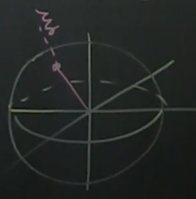

[Part
6](https://www.youtube.com/watch?v=FLByezr38Ps&list=PLMrJAkhIeNNR20Mz-VpzgfQs5zrYi085m&index=6) -
Controllability, reachability, and eigenvalue placement

As always, keeping in mind $\dot{x}=Ax+Bu$, where $x\isin\Reals^n$

- From last time, the controllability matrix $Ç=\begin{bmatrix}BABA^2BA^3B...A^{n-1}B\end{bmatrix}$
  - And $rank(Ç)=n \iff$ system is controllable
  - Matlab command: `>> rank(ctrb(A, B))`
  - Effectively a binary test for controllability

### Three equivalent things

If one of these is true, then _all_ are true

1. System is controllable
    - Based on $rank(Ç)=n$
1. "Poles" can be placed arbitrarily
    - In this case, "pole" just means eigenvalue (pole being used for historical reasons)
    - $u=-Kx \implies \dot{x}(A-BK)x$, from [part 5](part05.md)
    - Assuming #1 above, you can pick **any** eigenvalues such taht there exists a matrix $K$ that
      $(A-BK)$ will have these eigenvalues.
    - Neat! That means $A-BK$ means we can have arbitrary eigenvalues!
    - Matlab command: `K=place(A, B, eigs)`
1. Reachability: the system can reach any vector in $\Reals^n$
    - Reachable set $\Re_t=\begin{Bmatrix}\xi\isin R^n \Big\rvert there\ is\ an\ input\ u(t)\ s.t.\ x(t)=\xi\end{Bmatrix}$
      - Note: $\xi$ effectively means all vectors in $\R^n$
    - Also note that this doesn't mean this is _physically_ possible; just that there's a
      mathematical solution to the equations.
    - $\Re_t=\R^n \larr$ means we can drive the state _anywhere_ via $u$

### Thinking about it in terms of unit sphere

In this case, $\xi\isin\R^3$. Because of the linear relationship $u=-Kx \implies \dot{x}(A-BK)x$,
that means $\xi$ is directly scaled by $u$

### Take-away

Assuming a system is controllable, we can drive unstable systems into stable half (of continuous
domain) using $u=-Kx$
