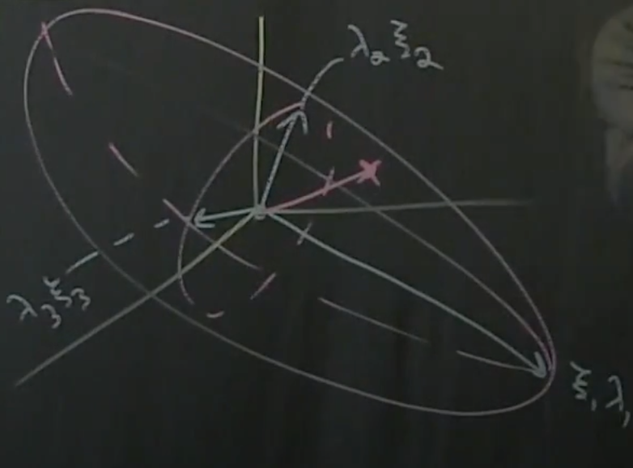

[Part
8](https://www.youtube.com/watch?v=ZNHx62HbKNA&list=PLMrJAkhIeNNR20Mz-VpzgfQs5zrYi085m&index=8) -
Degrees of controllability and Gramians

As always, $\dot{x}=Ax+Bu$

- In absense of control, solution is $x(t)=e^{At}x(0)$
- In absense of initial condition, solution is $x(t)=\int_0^t e^{A(t-\tau)}Bu(\tau)d\tau$
  - Combined, solutions is $x(t)=e^{At}x(0) + \int_0^t e^{A(t-\tau)}Bu(\tau)d\tau$
  - Looks complicated, but you can think of it as a convolution with kernel $e^{At}$ with the input $u$
    - Will get into convolution representation in later episodes

### Controllability "Gramian"

- Diving right in, Gramian equation is $W_t=\int_0^te^{At}BB^Te^{A^T\tau}d\tau$
- When working with abstract mathematical concepts, often useful to think to yourself, "What am I, and in what space do I live?"
  - $W_t$ lives in $n\times n$ space (i.e. $\R^{n\times n}$)
  - $e^{At}$ lives in in $n\times n$ space
  - $BB^T$ is $(n\times m)\times(m\times n)$ space, or $n\times n$
  - Finally $e^{A^Tt}$ lives in $n\times n$ space
  - Thus overall in $n\times n$ space
- In this case (not always?), $W_t$ is real valued and symmetric
  - This results in *positive, real eigenvalues*
- Look at the eigen decomposition of $W_t\cdot\xi=\lambda\cdot\xi$
  - The eigenvalues of $W_t$ contain interesting information: if we order $\lambda$ eigenvalues from largest to smallest, they correspond to the vector $\xi$ that is **most controllable** in state space $x\isin\R^n$
  - This is super cool; gives us not just a binary signal like `rank(Ç)` does, but also the degree of controllability!
- Implication: given a (normalized) unit impluse 1 across $u$, we can tell which "control knobs" will affect our system the most _and in what direction the state space will move_
- For discrete systems, $W_t$ can be approximated by $ÇÇ^T$ (which is also $n\times n$)
  - Because of this relationship, the eigenvectors/values of $W_t$ are the _singular values_ of $Ç$
    - TODO(blakely): Why?
  - Easily calculatable in matlab: `[U,Σ,V]=svd(Ç, 'econ')`
  - Biggest eigenvalues $\lambda$ in $W_t\cdot\xi=\lambda\cdot\xi$ are the singular values $\Sigma$ (squared, in the case of Matlab)
    - As expected since it represents eigenvalues, $\Sigma$ is a diagonal matrix
  - Since we've got eigenvalues $\lambda$, there are also eigen _vectors_ $\xi$, which correspond to the **columns** of $U$ in the matlab command above
- Take-away: Eigen decomp/SVD of $W_t$ gives us not only a binary signal whether system is controllable, but an **ordered** list of controllable dimensions in the state space $x\isin\R^n$

### Controllability eigs as "energy ellipsoid"

- For 1 unit of (normalized) input energy, you can think of the ellipsoid that can be drawn according to vectors $\xi_n$ as the "energy ellipsoid"
  - Analogy: given a single gallon of gasoline, how far can you go in each direction?

- The principal axes of the ellipsoid are the singular vectors of $Ç$
  - _Note: pretty sure this is equivalent to PCA_
- Nice part about this representation: it's phsyical and intuitive

### State space dimensionality and controllability

- In some cases, state space $x$ might be super-high-dimensional e.g. $\R^1e6$
  - Way too much to ask that every single dimension of $x$ is controllable
  - But in many cases, likely don't need to control everything, and only care about a few specific dimensions
  - It could be that many directions in $\R^n$ are inherently stable and do not require control at all
    - Effectively going back to [part 03](part03.md): $\dot{x}=Ax$, where many eigenvalues are negative, thus stable
- New conecept: "stabilizability", kind of a subset of "controllability"
  - $iff$ all _unstable_ directions - eigenvectors of $A$ that have positive eigenvalues -  are in the controllable subspace, then system can be stabilized
    - "Controllable subspace" again, means column vectors of controllability matrix $Ç$
  - Can be slightly expanded to $iff$ all "_unstable and lightly damped_ directions..."

