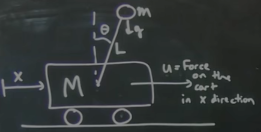
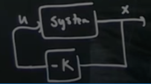

[Part 11]() - Inverted pendulum cart!

Note that this segment has a lot of matlab; not going to copy most of it here, so see the video for more

- Going over the setup of the inverted pendulum cart
- System setup:
  - $M$: mass of cart
  - $m$: mass of pendulum
  - $g$: gravity
  - $x$: linear position
  - $u$: horizontal force
  - $\theta$: angle from vertical (down = $0$)
  - $L$: length of rod
- State setup: $\underset{\bar{}}{x} = \begin{bmatrix}x\\\dot{x}\\\theta\\\dot{\theta}\end{bmatrix}$
  - Four states, but really only two degrees of freedom
- Fixed points at $\theta=0$ and $\theta=\pi$ for down and up, respectively
  - Fixed point states: $\begin{bmatrix}x\\\dot{x}\\\theta\\\dot{\theta}\end{bmatrix}=\begin{bmatrix}free\\0\\0\ \&\ \pi\\0\end{bmatrix}$
- Model system as continuous: $\frac{d}{dt}\underset{\bar{}}{x}=\underset{\bar{}}{f}(\underset{\bar{}}{x}) \Rarr \dot{x}=Ax+Bu$
  - Note that system is _very_ nonlinear for $\underset{\bar{}}{f}(\underset{\bar{}}{x})$
  - We can get $\underset{\bar{}}{f}(\underset{\bar{}}{x})$ - aka the Jacobian - via Euler-Lagrange solution. Pretty nasty overall, and by far the hardest part of this example
- Steps to solve in general:
  1. Find the Jacobian $\underset{\bar{}}{f}(\underset{\bar{}}{x})$
  1. Plug in the fixed points to get a linearized system $\dot{x}=Ax+Bu$
  1. Determine if the system is controllable
  1. Create a controller $K$ (next part)

### Matlab example setup

- Begins at [5:43](https://youtu.be/qjhAAQexzLg?list=PLMrJAkhIeNNR20Mz-VpzgfQs5zrYi085m&t=343) in the video
- Sets up function to calculate cart state
  - Note that in his example he uses $y$ for state instead of $\underset{\bar{}}{x}$
  - `dy = cartpend(y,m,M,L,g,d,u)`
  - Same as system setup above, but $d$ is a damping function to simulate friction in the system
- Initial condition: $\underset{\bar{}}{x}_{\theta=\pi} = \begin{bmatrix}0\\0\\\pi\\0.5\end{bmatrix}$
  - Vertical, but with a clockwise angular velocity to begin with
- Offline Steve found $A$ and $B$ matrices. They're constants, but derived from `cartpend` parameters
- Calculate eigenvectors: `eig(A)`=$\begin{vmatrix}0\\-2.46\\-0.1\\2.4\end{vmatrix}$
  - The last positive eigenvalue implies that the _system is unstable_
    - Makes sense physically; if we're $\epsilon$ away from vertical, the system will continue to progress and fall down
  - _But unstable does not mean uncontrollable_
- Check for controllability
  - Find controllability matrix: `ctrb(A, B)` gives a $4\times4$ matrix ($n\times n$)
  - If rank of controllability matrix is $n$, is controllable: $rank(ctrb(A, B))=4$
  - Definitely controllable
- Next time: designing controller $K$
  - $u=-Kx$, which gives control matrix $\dot{x}=(A-BK)x$

