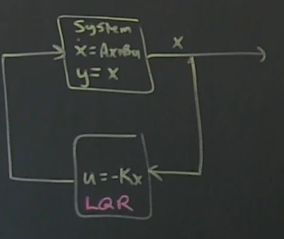
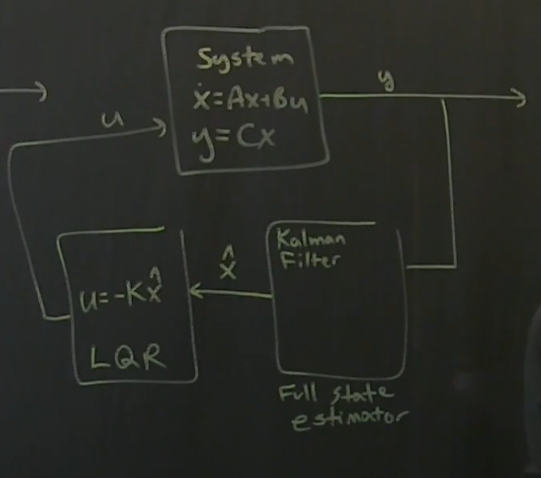
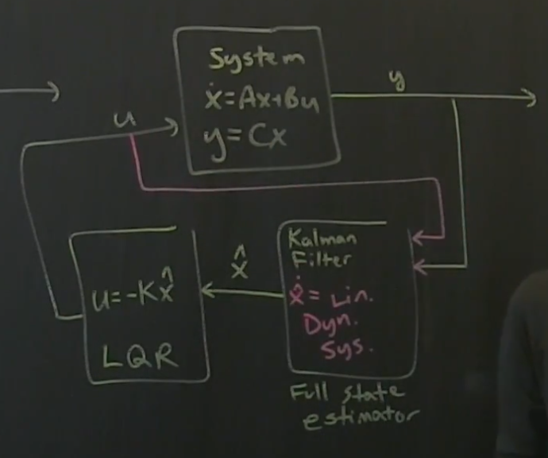

# Part 15 - [Motivation for full-state estimation](https://www.youtube.com/watch?v=LTNMf8X21cY&list=PLMrJAkhIeNNR20Mz-VpzgfQs5zrYi085m&index=15)

$\dot{x}=Ax+Bu$, $x\isin\reals^n$, $u\isin\reals^q$

If control is possible, can we design a control law $B$?
- For now, we'll assume we can measure everything
- In other words, $y=\lambda$
- Controller $u$ in ***full state feedback*** case is $u=-K_rx$, which means, again, we can rewrite as $\dot{x}=Ax-BK_rx$
  - $K_r$ is "regulator"

  

- By algebra, $\dot{x}=\left(A-BK_r\right)x$
  - "Full authority" to manipulate eigenvalues of "system" with closed-loop feedback to make them anything we want
  - LQR is a particularly good choice
    - Allows tradeoffs between agressive stablization and control effort

What if we can only measure a _subset_ of the full state X?
- Means $y$ is no longer equal to the output, but is now equal to some combination $y=Cx$, with $y\isin\reals^P$
  - $P$ measurements of system (can be $\lll x$)
  - Dual notion: observability (`obsv(A,C)`) and controllability (`ctrb(A, B)`)
    - Linear algebra for Obs and Ctr are effectively same linear algebra
  - Observability: "Can I estimate any high dim state $\underbar{x}$ form measurements $y(t)$?"

Working with a more realistic system
- System: $\dot{x}Ax+Bu$ and $y=Cx$
  - Output of system is $y$, _not_ $x$
- "Estimator" where controller was before
  - e.g. ubiquitous Kalman Filter
  - "Full state estimator"
  - Output of estimator is an estimate of full state $x$, represented as $\hat{x}$
- Output of estimator goes into optimal, full-state feedback controller
  - $u=-K\hat{x}$ (LQR)
- Finally, $u$ is fed back into system

  

Complication: if we want to really estimate our state $x$ for measurements $y$ in $y=Cx$, we _also_ have to know how we've been kicking our system via $u$
- Which means we need to have $u$ as an additional input to our estimator
- For Kalman Filter, it's a "dynamical system" $\dot{\hat{x}}=Linear\ Dynamical\ System$ (abbreviated here)
  - Estimates full state $\hat{x}$

  
- Neat: same estimation techniques for LQR can be done for optimal Kalman Filter
  - Again, same linear algebra
  - Can be done in isolation from each other

TL;DR: sensors are expensive (and potentially noisy), so we'll have limited measurements to control our system.
