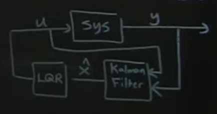
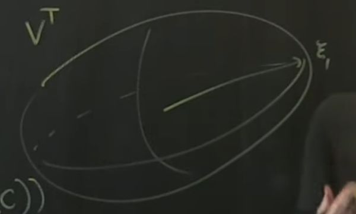

# Part 16 - [Observability](https://www.youtube.com/watch?v=iRZmJBcg1ZA&list=PLMrJAkhIeNNR20Mz-VpzgfQs5zrYi085m&index=16)

$\dot{x}Ax + Bu$
$y=Cx$

Talking observability and estimators. Goal: "if a system is observable, can we build an estimator so
that only given measurements of $y$, we can reconstruct full state $x$

Duality between $A,B$ and $A,C$
- Observability matrix:
$$\omicron=\begin{bmatrix}
  C\\
  CA\\
  CA^2\\
  CA^3\\
  \vdots\\
  CA^(n-1)\\
\end{bmatrix}$$
  - where $n$ is dimensionality of full state ($x\isin\reals^n$)

- Remember, controllability matrix $\mathcal{C}=\begin{bmatrix}A\ AB\ A^2B\ \dots A^nB\end{bmatrix}$
  - Looks awfully like $\omicron$, just transposed
- Basically same linear algebra for observability and controllability

Similarities:
1. If the row space of $\omicron$ spans $\reals^n$, then system is observable
  - Same rank condition
  - Octave: `obsv(A, C)`, builds matrix $\omicron$, and can take rank simply by `rank(obsv(A,C))`
1.  If it's observable, we can reconstruct entire state $x$ given measurements $y$
  - Very much like reachability

Estimator (Kalman Filter) has eigenvalue/vectors
- Eigenvalues of KF can tell us how fast $\hat{x}$ converges to true state $\x$
  - [Ed note: neat!]
- Just like we can do eigenvalue placement in controllability, we can do eigenvalue placement in the
  estimator to make it go faster or slower
- Note: arbitrarily fast estimation is _not_ always desirable
  - Example: system is corrupted with noise/disturbances
  - Too aggressive eigenvalues for estimator would make state estimation super noisy
- Consequence: it too has a Gramian
  - Not worth going into, but similar to controllability Gramian $W_t=\int_0^te^{At}BB^Te^{A^T\tau}d\tau$
  - Is a square $n\times n$ matrix
  - Eigenvalues/eigenvectors tell not just binary y/n observable, but scalar in _how_ observable it is
  - `[u,Σ,v]=svd(ο)`
    - We care about row space, so columns in `v` (rows in $v^\Tau$) will indicate that there are
      some directions where it's "easier" to observe, given measurements $y$
    - In this case, "easier" means less noise
  - Very much ellipsoidal, again, like controllability

    

  - Brings in concept of "signal to noise"
