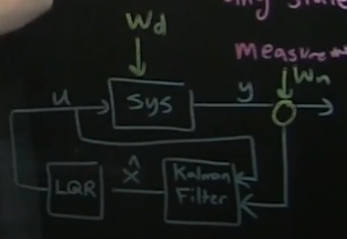

# Part 17 - [Full-state estimation](https://www.youtube.com/watch?v=MZJMi-6_4UU&list=PLMrJAkhIeNNR20Mz-VpzgfQs5zrYi085m&index=17)

$\dot{x}Ax + Bu$
$y=Cx$

Schematic of estimator
- Not even going to call it a Kalman Filter until it's optimal
- Input: control input $u$ and measurements $y$
  - Need to know how we're kicking system $u$
- Output: estimate $\hat{x}$ of full state

System: linear dynamical system

$$
\frac{d}{dt}\hat{x}=A\hat{x}+Bu+K_f\left(y-\hat{y}\right)
$$

- where $K_f$ is the gain matrix for estimator, and $\hat{y}$ is just the version of $y$ we get from
  doing $\hat{y}=C\hat{x}$ instead of $y=Cx$
  - Remember, for LQR $K_r$ is the optimal gain matrix found by `lqr(A,B,Q,R)`
  - $\hat{y}$
- Note how close it looks to linear dynamical system $\dot{x}$, except every time we get a new
  measurement, we compare it against the measurement we're expecting ($\hat{y}=C\hat{x}$), and if we
  have a difference ($\left(y-\hat{y}\right)$) we correct the change in state $\frac{d}{dt}\hat{x}$
- In other words, $K_f\left(y-\hat{y}\right)$ is the **update based on new data $y$**
  - As we get new measurements in $y$, we begin to correct full state estimate $\hat{x}$

Exercise: plug in $\hat{y}=C\hat{x}$ and see what we get for state $\hat{x}$

$$
\frac{d}{dt}\hat{x}

=A\hat{x}+Bu+K_f\left(y-C\hat{x}\right)

=A\hat{x}+Bu+K_fy-K_fC\hat{x}

=(A-K_fC)\hat{x}+Bu+K_fy
$$

$$
=(A-K_fC)\hat{x}+\begin{bmatrix}B K_f\end{bmatrix}\cdot\begin{bmatrix}u \\ y\end{bmatrix}
$$

- Note how $\begin{bmatrix}u \\y\end{bmatrix}$ are just the inputs to full state estimator!
  - Which means $\begin{bmatrix}B K_f\end{bmatrix}$ are just the new $B$ matrix in our linear
    dynamical system, and $\left(A-K_fC\right)$ is our new $A$ matrix, aka the _dynamics of_
    $\hat{x}$
- Can show that if dynamics $\left(A-K_fC\right)$ are stable, then $\hat{x}$ will stably converge to
  $x$

Goal: compute error of $\left(A-K_fC\right)$
- Kinda messy, hold on...
- Define an error $\mathcal{E}=x-\hat{x}$
  - Basically how far is our estimated state away from the true state
- Compute $\frac{d}{dt}\mathcal{E}$, and show that it has dynamics of $\left(A-K_fC\right)$
  - Ideally $\mathcal{E}$ goes to zero, so we need to choose dynamics $\left(A-K_fC\right)$ correctly

$$
\frac{d}{dt}\mathcal{E}=\frac{d}{dt}x-\frac{d}{dt}\hat{x}
$$

$$
=Ax + Bu \frac{d}{dt}x-\frac{d}{dt}\hat{x} - \left((A-K_fC)\hat{x}+\begin{bmatrix}B K_f\end{bmatrix}\cdot\begin{bmatrix}u \\ y\end{bmatrix}\right)
$$

$$
=Ax + Bu - A\hat{x}+K_fC\hat{x}-K_fy - Bu
$$

- Right off the bat, $Bu$ terms cancel

$$
=Ax - A\hat{x}+K_fC\hat{x}-K_fy
$$

- Now, sub in observability eqn $y=Cx$

$$
=Ax - A\hat{x}+K_fC\hat{x}-K_fCx
$$

$$
=A\left(x-\hat{x}\right) + K_fC(\hat{x} - x)
$$

- Flip sign of $K_fC(\hat{x} - x)$

$$
=A\left(x-\hat{x}\right) - K_fC(x-\hat{x})
$$

$$
\frac{d}{dt}\mathcal{E}=\left(A-K_fC\right)\left(x-\hat{x}\right)
$$

- But from way back where we started, $\mathcal{E}=x-\hat{x}$, thus:

$$
\frac{d}{dt}\mathcal{E}=\left(A-K_fC\right)\mathcal{E}
$$

Takeaway: error between true full state $x$ and estimated state $\hat{x}$ can be made stable (go to
zero) if the system is observable
- If `obsv`, then we can place the eigs by choosing $K_f$
  - Could quite literally just use `lqr` command or `place` command to get $K_f$ that puts our eigs
    where we want them to be
  - ***BUT*** since we're in observability land we'd have to use the transposes $A^T$ and $C^T$

TL;DR: If the system is observable, we can build $\frac{d}{dt}\hat{x}$ dynamical system with inputs
$u$ and $y$, that will stably converge ($\mathcal{E}=x-\hat{x}$) to the full state of the system (by
making $\mathcal{E}$ go to zero)

Sneak peek: Why not just ramp eigenvalues way into the left half of the plane?
- Turns out since sensors are inherently noisy there's a hidden noise term $w_n$ we've been glossing over
  $n$ $y=Cx + w_n$
- And in addition, there's also some potential disturbance to our state $w_d$, resulting in $\dot{x}=Ax+Bu+w_d$

