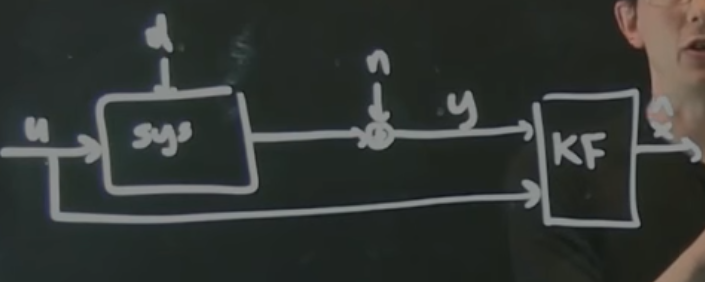
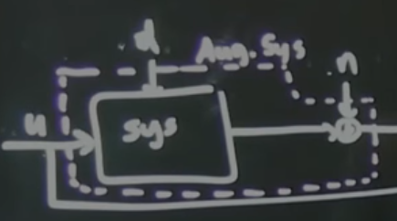

# Part 21 - [Kalman filter example (inverted pendulum)](https://www.youtube.com/watch?v=Lgq4R-F8SX8&list=PLMrJAkhIeNNR20Mz-VpzgfQs5zrYi085m&index=21)

(Another matlab-heavy one)

Pendulum state $\underbar{x}=\begin{bmatrix} x \\ \dot{x} \\ \theta \\ \dot{\theta}\end{bmatrix}$

Using measurement matrix $C=\begin{bmatrix}1&0&0&0\end{bmatrix}$

Actually pretty difficult to demonstrate KF for system in upwards state (unstable)
- Linearized model only valid when pendulum is up, _not_ at larger angles
- Only valid in unstable version during swinging up to approach vertical

To build KF, a few extra steps needed
- Augmented system that has disturbances and noise
- Disturbances as input to system, noise as modifier for output of system (prior to $y$)

    

- $V_d$ is a matrix of disturbance covariances. In this case $0.1*I=\begin{bmatrix}.1\\&.1\\&&.1\\&&&.1\end{bmatrix}$
  - Each row corresponds to the disturbance covariance in each state; in this case linearly independent
  - Akin to $Q$ and $R$ matrices that balance state deviations and control expenditures
  - "Tuning knob"
- $V_n$ is noise covariance (diagonal 1 matrix in this example)
  - Can be tweaked/tuned, based on ratio of both

Build augmented $B$ matrix (with disturbance and noise) via `BF = [B Vd 0*B]`
- State becomes $\dot{x}=Ax+Bu+V_dd+0n$ and $y=Cx+\cancel{Du}+0d+V_nn=Cx+0u+0d+V_nn$
- "Augmented state" is now:

  

- Thus the "noise" term in `BF` above is just `0*B`

Build augmented $D$ (feed-through) term `D=[0 0 0 0 0 Vn]`
- Corresponds to $y=Cx + \boxed{0u+0d+V_nn}$
- Thus $D=\begin{bmatrix}0&0&V_n\end{bmatrix}$ multiplied by the input $\begin{bmatrix}u\\ d\\ n\end{bmatrix}$
  - Not clear at the moment where the extra couple `0`s come from...?

Create state-space system via `sysC = ss(A, BF, C, [0 0 0 0 0 Vn])`

Create _true_ system (non-restricted-visibility on system measurements) via `sysFullOut = ss(A, BF,
eye(4), zeros(4, size(BF,2)))`

Actually build the KF
- `[Kf,P,E] = lqe(A, Vd, C, Vd, Vn)` _or_ `Kf = (lqr(A', C', Vd, Vn))';`
  - Latter shows that `lqr` and `lqe` are solving the same fundamental equations
- State space for Kalman Filter: `sysKF = ss(A-Kf*C,[B Kf],eye(4),9*[B Kf])`

Simulating with some noise
- function to use is `lsim`
