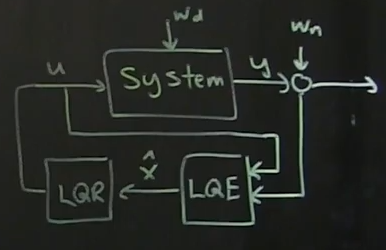

# Part 22 - [Linear Quadratic Gaussian (LQG) and the Separation Principle](https://www.youtube.com/watch?v=H4_hFazBGxU&list=PLMrJAkhIeNNR20Mz-VpzgfQs5zrYi085m&index=22)

$\dot{x}=Ax+Bu+w_d$

$y=Cx+w_n$

If we have a linear system that is controllable and observable, we can design an _optimal_
full-state feedback controller using LQR.
- Can also develop optimal estimator (KF)
- Key point: combination of both optimals it _itself_ optimal (mostly)

Linear Quadratic Gaussian controller
- Linear: linear system
- Quadratic: minimizes quadratic cost function
- Gaussian: system assumes gaussian disturbances
- Sometimes system can be arbitrarily fragile
  - Nonlinear dynamics
  - Non-gaussian, etc
- Motivation for "robust control" (later)

Digging into eigenvectors/vals of combined LQG system (LQR + LQE + gaussian noise)
- $\dot{x}=Ax+Bu+w_d$ but $u=-K_r\hat{x}$, so $\dot{x}=Ax-BK_r\hat{x}+w_d$
  - $\dot{x}=Ax-BK\hat{x}+w_d$
  - From $\mathcal{E}=x-\hat{x}$ we can say $\hat{x}=x-(x-\hat{x})$
- Sub into $\dot{x}$: $\dot{x}=Ax-BK_r\left(x-\left(x-\hat{x}\right)\right)+w_d$
  - $=Ax-BK_rx + BK_r(x-\hat{x})+w_d$
- Remember $\dot{\mathcal{E}}=\left(A-K_fC\right)\mathcal{E}+w_d-K_fw_n$

$$
\frac{d}{dt}
\begin{bmatrix}
  x \\ \mathcal{E}
\end{bmatrix}=
\begin{bmatrix}
  \left(A-BK_r\right) & BK_r \\
  0 & \left(A-K_fC\right) \\
\end{bmatrix}
\begin{bmatrix}
  x \\ \mathcal{E}
\end{bmatrix}
+
\begin{bmatrix}
  I & 0 \\
  I & -K_f
\end{bmatrix}
\begin{bmatrix}
  w_d \\ w_n
\end{bmatrix}
$$
  - Note that state is $\begin{bmatrix}x \\ \mathcal{E}\end{bmatrix}$, since we want both of these to be stable
  - $w_d$ and $w_n$ are the "exogenous" inputs to system

Take-away: the eigenvalues of $\begin{bmatrix}\left(A-BK_r\right) & BK_r \\ 0 & \left(A-K_fC\right) \\ \end{bmatrix}$ are actually the eigenvalues of $\left(A-BK_r\right)$ and $\left(A-K_fC\right)$
- Eigenvalues of full state $x$ are still stabilized only by eigenvalues of full state controller $\left(A-BK_r\right)$
- Eigenvalues of error state $\mathcal{E}$ are still stabilized only by eigenvalues of estimator $\left(A-K_fC\right)$
- This is called the **separation principle**
- Can design LQR and LQE separately, and the combined system retains joint optimizations
