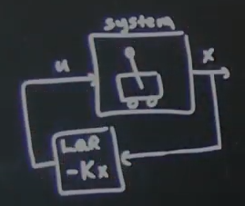

# Part 23 - [LQG example in matlab](https://www.youtube.com/watch?v=reRT8LbPhBs&list=PLMrJAkhIeNNR20Mz-VpzgfQs5zrYi085m&index=23)

More matlab cart-poles

Initial cart model:

Going to plug in LQE
- Stabilizing around $\begin{bmatrix}x\\ \dot{x} \\ \theta \\ \dot{\theta}\end{bmatrix}=\begin{bmatrix}0\\0\\ \pi \\0\end{bmatrix}$

Implementation in simulink
