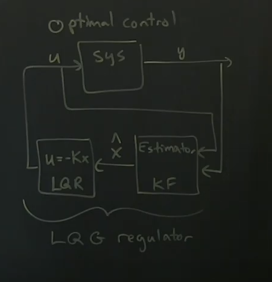

# Part 24 - [Introduction to Robust Control](https://www.youtube.com/watch?v=Y6MRgg_TGy0&list=PLMrJAkhIeNNR20Mz-VpzgfQs5zrYi085m&index=24)

Previously, optimal control: $\dot{x}=Ax+Bu$ and $y=Cx$

Modern theory: **robust control**
- Optimal is historically used and first place to start most of the time
- Paper by John Doyle (1978): [Guaranteed Margins for LQG regulators](https://authors.library.caltech.edu/93672/1/01101812.pdf)
- If you're building up an estimate of the system $\hat{x}$ based on partial observation $y$, are there any guarantees on stability of the overall system, including time delays?

Core point: ***there are no guaranteed stability margins for LQG regulators***
- Combined LQR and KF might be arbitrarily sensitive to things like model uncertainty and time delays; it can be arbitrarily non-robust
- In other words, the stability of the system doesn't guarantee that it is robust

New concept: Robustness and Performance
- Closed-loop eigenvalues of system and how fast you can estimate are measure of Performance
  - How fast does it respond, how well does it perform
- Can have high nominal performance, but can potentially have nearly zero robustness to model uncertainty
