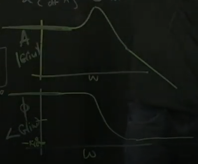

# Part 26 - [Example Frequency Response (Bode Plot) for Spring-Mass-Damper](https://www.youtube.com/watch?v=e-8y4MTT7NQ&list=PLMrJAkhIeNNR20Mz-VpzgfQs5zrYi085m&index=26)

Bode plots!

Recap: transfer function $G$ is the laplacian representation of our state-space system
- Magnitude $\left|G(i\omega)\right| = A$ and phase $\angle G(i\omega) = \phi$
- Complex function, so $s\isin\Complex$
  - If you plug in $s=i\omega$ aka a sine wave in, it gives you $Asin(\omega t + \phi)$

Illustrate what this means _physically_ in spring-mass-damper system

- Spring constant $K$, mass $m$, damping coefficient $d$, and horizontal offset $x$
- Relatively easy to determine equations of motion
  - $m\ddot{x}+d\dot{x}+kx = u$
  - $u$ is the same 'ol forcing function we've been talking about e.g. if you hit it with a hammer, move the wall around, etc
  - Could build augmented/state-space system by introducing system as $\begin{bmatrix}\dot{x}\\ \ddot{x}\end{bmatrix}$
- Instead, let's look at the laplace transform of this system to build frequency response, known as the Bode plot
  - $\mathcal{L}\begin{Bmatrix}\frac{d}{dt}x\end{Bmatrix}=s\bar{x}(s) - x(0)$
    - Usually in laplace world we assume that the initial conditions ($x(0)$) and transients die out, so we're left with $\mathcal{L}\begin{Bmatrix}\frac{d}{dt}x\end{Bmatrix}=s\bar{x}(s)$
  - Copied in nice table form from [the devlog](../devlog/20210815.md):
$$
\begin{array}{c:c}
 f(t) & f(s) \\ \hline
\delta(t) & 1 \\
x(t) & x(s) \\
\dot{x}(t) & sx(s) - x(0)\\
\ddot{x}(t) & s^2x(s) - sx(0) - \dot{x}(0)
\end {array}
$$
  - Or applying transient assumption of $x(0)=0$ and $\dot{x}(0)=0$ above:
$$
\begin{array}{c:c}
 f(t) & f(s) \\ \hline
\delta(t) & 1 \\
x(t) & x(s) \\
\dot{x}(t) & sx(s)\\
\ddot{x}(t) & s^2x(s)
\end {array}
$$

Setting up the system. Real simple: set coefficients $m,d,k=1$
- $\ddot{x}+\dot{x}+x = u$
  - Can solve this ODE in general by plugging in $e^{\lambda t}$ and you'd get $(\lambda^2+\lambda+1)e^{\lambda t}$ as "characteristic polynomial"
- Instead, plug in laplace terms: $s^2\bar{x}+s\bar{x}+\bar{x}=\bar{u}$
  - Remember: $\bar{x}$ just means $x$ in laplace space
  - $\left(s^2+s+1\right)\bar{x}=\bar{u}$ - aka the characteristic polynomial
  - Key point: _the roots of $\left(s^2+s+1\right)$ are the eigenvalues of the system_
- Finally: $\frac{\bar{x}}{\bar{u}}=\frac{1}{s^2+s+1}$

Steps:
1. Set up ODE
1. Laplace transform
1. Rearrange equations to get $\frac{\bar{x}}{\bar{u}}$, the transfer function from $\bar{u}$ to $\bar{x}$

Use transfer function to figure out the responses $A$ and $\phi$ for all frequencies
- Could plug in $i\omega$ for all values of $\omega$ (all frequencies, all values in complex plane) and compute magnitude and the phase of $\frac{1}{s^2+s+1}$
- Would tell you what output sines are for what input sines are

Frequency response sweep AKA Bode plot
- (Showing example with telephone hanging by curled cord)
- Low frequencies: matches exactly input motion and stays completely in phase, so $A=1$ and $\phi=0$
- Super high frequencies: basically stays in place. Phase is hard to tell, but plugging in $i\omega$ shows it picks up a $-180\degree$ phase shift, so $A=0$ and $\phi=-180$
- In the middle: "sweet spot frequency" resonant frequency where the input is small but the output is large, so $A>1$, and at that point you pass through $\phi=-90$

  
- This is the Bode plot (frequency response)
  - Really informative. If there are resonant frequencies (peaks) that are undesirable, can design controller to focus on that frequency to dampen the response

This is why $G\left(\bar{s}\right)$ is so useful
- Can just plug in $i\omega$ directly, sweep through $\omega$, and you get amplitude and phase response

In Matlab:
1. Define laplace function `s=tf('s')`
1. Set up transfer function `G = 1/(s^2+s+1)`
1. Compute Bode plot by `bode(G)`

What happens if you tweak coefficients?
- Example: add a lot more damping $d$ to $\dot{x}$
  - Should completely get rid of peak

    
- Example: make $d$ really small
  - `G = 1/(s^2+.1*s+1)`
  - Resonant peak higher

    

Other things you can do with a transfer function in Matlab
- Compute impulse response via `impulse(G)`
- Compute step response via `step(G)`

In sum: looking at Bode plots can tell us a lot about the system
- Robustness
- Where is it sensitive
- What kind of disturbances can it reject
- What kind of noise is it sensitive to
