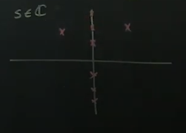
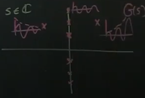

# Part 27 - [Laplace Transforms and the Transfer Function](https://www.youtube.com/watch?v=0mnTByVKqLM&list=PLMrJAkhIeNNR20Mz-VpzgfQs5zrYi085m&index=27)

More about transfer function $G(s)$
- Complex value
- Frequency domain
  - If I force $u$ at a given frequency $\omega$, what does output $y$ do?

Laplace transforms
- Generalized fourier transform that's valid for functions that might grow exponentially (unbounded
  at $\plusmn \infty$)
- Laplace of $\dot{x}=Ax+Bu$ and $y=Cx$ is $G(s)=C(sI-A)^{-1}B$ (derivaiton to follow)
- Generally (note that integral starts just before $0$, so inclusive):
$$\mathcal{L}\left\{x(t)\right\}=\int_{0^-}^\infty x(t)e^{-st}dt=\bar{x}(s)$$
- Integrating over time with respect to $dt$ means all $t$ values will go away, leaving you with
  only $s$ terms
- Contrast with fourier transform:
$$
\mathcal{F}\left\{f(x)\right\}=
\int_{-\infty}^\infty f(x)e^{-i\omega x}dx
=\bar{f}(\omega)
$$
- In short, looks a lot like a one-sided fourier transform

What does this mean physically?
- $s\isin\Complex$
- If you evaluate $s$ at a position $i\omega$, it's like taking the fourier at that position
  - Can also have a negative or positive real part as well

  

$\bar{Y}(s)=\bar{G}(s)\bar{u}(s)$

So...

$\frac{\bar{Y}(s)}{\bar{u}(s)}=\bar{G}(s)=C(sI-A)^{-1}B$
- Thinking about $\bar{G}(s)$, if you plugged in a pure sine wave into $\bar{u}(s)$, that would be like an $e^{i\omega t}$
  - Aka evaluating your transfer function at one of the vertical points in the complex axis
  - For pure sine, would be exactly on the vertical complex axis
- If you plugged in decaying sine wave, that's like evaluating $G$ at some $-a+i\omega$, so left side of complex plane
- If you plugged in an exponential sine wave, that's like evaluating $G$ at some $a+i\omega$, so right side of complex plane

- Note that a pure fourier only handles sine waves on the vertical axis, or $i\omega$
- So that means the transfer function can take into account exponentially decaying and growing sine waves in addition to pure ones

Important for control!
- There may be a space in the transfer function plane where there is an exponentially growing locus
- Will need to have a pole/eigenvalue there
- (But will get to that later)

Important properties
- Laplace transform of $\dot{x}$: $\mathcal{L}\left\{\frac{d}{dt}x(t)\right\}$, plug it right into $\mathcal{L}\left\{x(t)\right\}=\int_{0^-}^\infty x(t)e^{-st}dt$

$$
\mathcal{L}\left\{\frac{d}{dt}x(t)\right\}=
\int_{0^-}^\infty \frac{d}{dt}x(t)e^{-st}dt
$$
  - How do you solve this? Usually integration by parts
$$
\mathcal{L}\left\{\frac{d}{dt}x(t)\right\}=
\int_{0^-}^\infty \underbrace{\frac{d}{dt}}_{dv}\underbrace{x(t)e^{-st}}_{u}dt
$$

$$
=\left[uv\right]_{0-}^{\infty} - \int_{0-}^{\infty}v\cdot du\cdot dt
$$

- Since $dv=\frac{d}{dt}x(t)=\dot{x}$, then simply $v=x$
- Since $u=e^{-st}$, then $du=-se^{-st}$

$$
=\left[e^{-st}x\right]_{0-}^{\infty} - \int_{0-}^{\infty}x\cdot -se^{-st}\cdot dt
$$

$$
=\left[e^{-st}x\right]_{0-}^{\infty} + s\int_{0-}^{\infty}x\cdot e^{-st}\cdot dt
$$

- $e^{-s\infty}=0$ (so doesn't matter what $x(\infty)$ is) and $e^{-s0^-}=1$

$$
=0 - x(0) + s\int_{0-}^{\infty}x\cdot e^{-st}\cdot dt
$$

- Sneaky: $\int_{0-}^{\infty}x\cdot e^{-st}\cdot dt$ is just the laplace transform of $x$: $\mathcal{L}\left\{x(t)\right\}=\int_{0^-}^\infty x(t)e^{-st}dt=\bar{x}(s)$

$$
=0 - x(0) + s\mathcal{L}\left\{x\right\}
$$

Takeaway: $\mathcal{L}\left\{\dot{x}\right\}=s\mathcal{L}\left\{x\right\}-x(0)$
- Super cool: derivatives in $x$ just become polynomials in $s$!

Finally, derive transfer function $\frac{\bar{Y}(s)}{\bar{u}(s)}=\bar{G}(s)=C(sI-A)^{-1}B$ from $\dot{x}=Ax+Bu$ and $y=Cx$

$$
\mathcal{L}\begin{Bmatrix}
  \dot{x}=Ax+Bu \\
  y=Cx
\end{Bmatrix} = ?
$$

$$
\mathcal{L}\left\{\dot{x}\right\}=s\bar{x} - x(0) = A\bar{x}(s) + B\bar{u}(s)
$$

$$
\mathcal{L}\left\{y=Cx\right\}=\bar{y}(s)=C\bar{x}(s)
$$

- Now solve for $\bar{x}$ and plug into $\bar{y}(s)=C\bar{x}(s)$

$$
s\bar{x}(s) - A\bar{x}(s) = B\bar{u}(s) + x(0)
$$

- Since $A$ is a matrix, $s$ in matrix form is $sI$

$$
(sI-A)\bar{x}(s) = B\bar{u}(s) + x(0)
$$

$$
\bar{x}(s) = (sI-A)^{-1}B\bar{u}(s) + (sI-A)^{-1}x(0)
$$

- $(sI-A)^{-1}$ is kinda unique: 2nd order ODE means $\frac{1}{polynomial\ in\ s}$, where the polynomial is the characteristic equation of matrix $A$
  - Kind of like the eigenvalue equation
  - $(sI-A)^{-1}$ is degenerate (blows up) when $s$ is an eigenvalue of $A$
- Now

$$
\bar{y}=C(sI-A)^{-1}B\bar{u}(s) + C(sI-A)^{-1}x(0)
$$

- Can assume usually initial conditions are $0$, since we're concerned with steady-state situation after transients are gone

$$
\bar{y}=C(sI-A)^{-1}B\bar{u}(s) + \cancel{C(sI-A)^{-1}x(0)} \\
=C(sI-A)^{-1}B\bar{u}(s) \\
=\underbrace{\frac{C}{sI-A}B}_{G(s)}\bar{u}(s)
$$

That means if you have some input $u$ and you can find it's laplace transform $\bar{u}(s)$, you can find its output by just multiplying by the transform function $G(s)$
- Interpretation: plugging in sine wave for $u(t)$, we evaluate $G(s)$ at $i\omega$, and that results in your output sine wave
- Impulse response: $\bar{u}(t)=\delta(t)$ means $y(t)=\mathcal{L}^{-1}\left\{G(s)\right\}$
  - Said another way, transfer function is the laplacian of the impulse response $G(s)=\mathcal{L}\left\{y(t)\right\}$
- If you whack a system with a hammer and you watch it ring through, if you can collect that data and laplace transform it, you get an approximation of the transfer function
