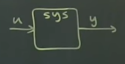
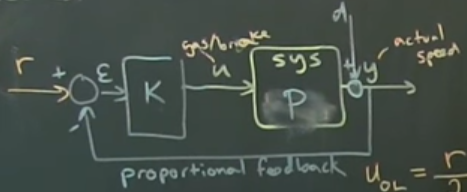

# Part 28 - [Benefits of Feedback: Cruise Control Example](https://www.youtube.com/watch?v=y4H03UOjlas&list=PLMrJAkhIeNNR20Mz-VpzgfQs5zrYi085m&index=28)

Benefits of feedback:
- Stability
- Uncertainty (in the plant)
- Disturbance
- Focusing this part on the latter two, demonstrating why feedback is beneficial over open-loop control

Cruise control model

- $u$ is how much gas/brake you give the system, $y$ is actual speed of car
- Input/goal: track a reference speed
- Potential disturbances
  - Rolling hills, wind, etc

 Nominal model
- $y=2u$ for example
  - Note not really units here, just as an example; put foot down two units, you get one unit of speed
- reference speed $r$
- Goal: have output velocity equal to $r$
- Open loop control
  - $u_{ol}=r/2$
  - Pretty bad controller for a lot of reasons: uncertainty and disturbances
  - No way of correcting for any
  - Doesn't work with _true_ car, which is $y=u+d$ ($d$ is disturbances), since it becomes now $y_{ol}=\frac{r}{2} + d$

In practice, we close the loop with controller $K$

- Measure speed $y$, and add or subtract from reference speed $r$, resulting in error $\mathcal{E}$
- **Proportional** speed control
  - Proportional because $K$ is just a constant
    - For now; we can make $K$ have dynamics later
  - Feedback because we're feeding it back to calculate $\mathcal{E}$
- Again, true car is $y=u+d$
  - There's some "plant model" (some transfer function model) $P$
    - $P$ is vague here, but it's basically just a number for now.
    - Later we'll replace this with a transfer function to allow it to have some dynamics like a time delay
- $u_{cl}=K\mathcal{E}=K\left(r-y\right)$
- $y_{cl}=Pu+d$

Solve for $y_{cl}$ as a function of $r$ and $d$
- Proportional feedback $K$ brings $y_{cl}$ close to the reference $r$ even if we have disturbances $d$

$$y_{cl}=Pu+d=PKr-PKy_{cl}+d$$
$$(1+PK)y_{cl}=PKr+d$$
$$y_{cl}=\frac{PK}{(1+PK)}r+\frac{1}{(1+PK)}d$$

- $\frac{PK}{(1+PK)}$ tells you how well your output $y_{cl}$ matches your reference $r$
- $\frac{1}{(1+PK)}$ tells you how much disturbances get reduced by effective control
- Key point: if model is incorrect (model said that $P=2$, but the true car had $P=1$), then if we had a really big proportional feedback $K$ we can make $\frac{PK}{(1+PK)}\approxeq 1$
  - Along those lines, we want to make $\frac{1}{(1+PK)}$ try to go to $0$ since we want $d$ to go away
  - In the $P=2$ vs $P=1$ example, the open loop controller was off by 50%, whereas if you set $K=100$ then the closed loop is off by ~1% and the disturbances $d$ only contribute ~1%
