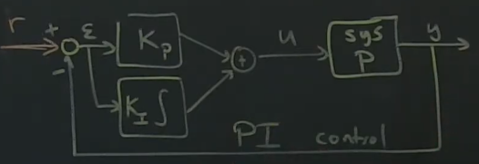
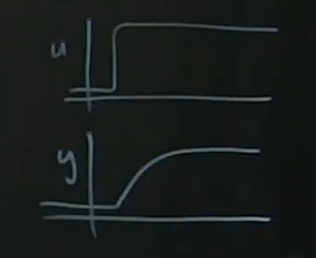
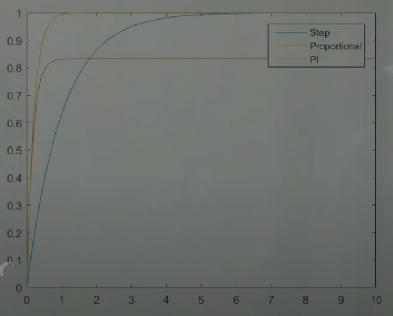
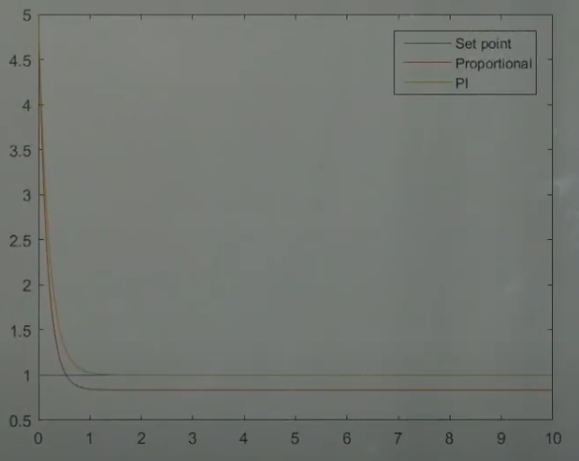

# Part 30 - [Cruise Control Example with PI Control](https://www.youtube.com/watch?v=vxTJMGqjGdg&list=PLMrJAkhIeNNR20Mz-VpzgfQs5zrYi085m&index=30)

Cruise controller model

A few strange things about the previous example
1. With pure proportional control $P$, there's always going to be some steady-state error during control
  - Because there will always be some difference between transfer function $y=\frac{PK}{1+PK}r$ and 1
2. Can potentially blow up if $K$ is too big
1. Sometimes you don't have the ability to make $K$ as big as needed (only have a Dodge Neon instead
   of a Tesla Plaid)

To fix steady-state error, rename $K$ to $K_p$ for proportional gain add another term $K_I\int\mathcal{E}$
- Add both together to get $u$
- This is called a PI controller: Proportional-Integral

  
- Integral control is **extremely** important for reducing steady-state error to 0
  - If there is some steady-state error, the integral begins to get bigger and bigger until it closes the gap and closes the $\mathcal{E}$ gap to 0

Original model of car's plant was simplistic and naiive: $y=u$ ($P=1$)
- Add dynamics to the system block (plant)
- A crude 1st order model for a car would be to say $\dot{x}=-x+u$ and $y=x$
  - Again, $y$ is speed of the car, and $u$ is like the gas/brake pedal
  - Now we introduce dynamic state $x$ which accounts for the intertia of the engine, car, wheels, etc
  - Takes a bit to ramp up
  - Transfer function $P$ is now not just a constant multiplication
- Take the laplace to get into frequency domain

$$
\mathcal{L}\left\{P\right\}=\mathcal{L}\left\{\begin{matrix}
  \dot{x}=-x+u \\
  y=x
\end{matrix}\right\} \\
\frac{\bar{y}}{\bar{u}} = P(s) = \frac{1}{s+1}
$$

- Pole is at $s=-1$
- Solution is something along the lines of $\int_0^tue^{-t}$

Now a step function in $u$, output $y$ is an exponential with some dynamics

Control law: $u=K_p(r-y) + K_i\int(r-y)dt$
- Note: since $y=x$ doesn't matter if we use $y$ or $x$ in control law
- Introduce new variable $z$ to capture the integral term
  - $\dot{z}=(r-state)=(r-x)$
    - In this case we do want it in terms of the real state $x$, not observations $y$
  - Neat trick: if we look at $z=\int\dot{z}$, it's actually $z=\int(r-x)$, so we can just use $z$ instead of re-writing $\int(r-x)$
    - $K_i\overbrace{\int(r-y)}^{z}dt$
  - When simulating, we'll have another ODE: $\dot{z}$
- $u=K_p(r-x)+K_iz$

System of equations is now:

$$
\dot{x}=-x+K_p(r-x)+K_iz \\
=\dot{x}=-x-K_px+K_iz+K_pr \\
where \dot{z}=(r-x)
$$
- Two-state, closed-loop system is $\dot{x}$ and $\dot{z}$
  - $\dot{x}$ is a function of the state $x$ and $z$, with the reference $r$ acts as the input to the system
  - $\dot{z}$ keeps track of what the integral term is doing

Summary of system in matrix form:

$$
\frac{d}{dt}\begin{bmatrix}x \\ z \end{bmatrix} =
\begin{bmatrix}
  -1-K_p & K_i \\
  1 & 0
\end{bmatrix}
\begin{bmatrix}x \\ z \end{bmatrix} +
\begin{bmatrix}K_p \\ 1 \end{bmatrix}r \\
y=\begin{bmatrix}1 \\ 0 \end{bmatrix}\begin{bmatrix}x \\ z \end{bmatrix} +
$$
- Only measuring first state

_Matlab sim_

Comaprison of open-loop vs P vs PI:

We can plot the control expenditure:

Next up: generalize $P$ and $K$ to work in frequency domain
- We can design a system with good performance purely by thinking about the transfer function $PK$ to look like
- Design controllers in state space, but look at performance in frequency domain with transfer functions
