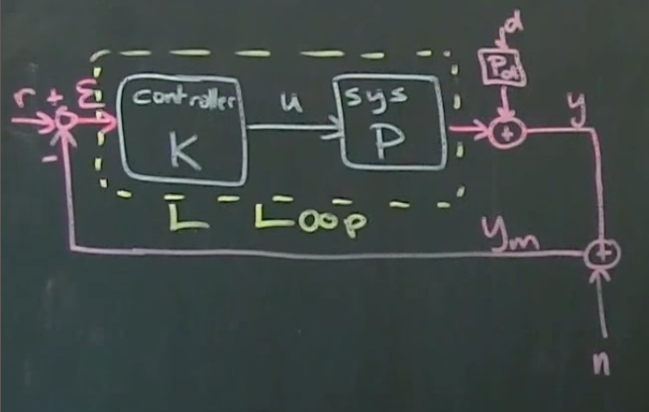

# Part 31 - [Sensitivity and Complementary Sensitivity](https://www.youtube.com/watch?v=hTu36q5yx20&list=PLMrJAkhIeNNR20Mz-VpzgfQs5zrYi085m&index=31)

Loop transfer function
- Includes just the controller $K$ and the plant (system) $P$, and feeedback resulting in error $\mathcal{E}$

Goals of feedback:
1. Stability (design)
1. Uncertainty (compensation)
1. Disturbance (rejection)
1. Noise (attenuation)
- Can look at all of these as properties of the transfer function
- Note that disturbances $d$ can have its own transfer function $P_d$

Loop transfer function $L$
- $L=PK$
  - By convention, it's $PK$ since it first passes through $P$, then $K$, then arrives at $L$
  - If these become matrices, then order becomes important and must be $PK$
- Write down $y$ as a function of $d$, $n$, and $r$
  - $y=P_dd+PK\mathcal{E}=P_dd+PK(r-y_m)=P_dd+PK(r-y-n)$
- Bring $y$ to one side
  - Note: assuming matrices, so $y$ is really $Iy$
  - $(I+PK)y=PKr+P_dd-PKn$
  - Assuming $I+PK$ is invertible, we can $y=(I+PK)^{-1}PKr + (I+PK)^{-1}P_dd - (I+PK)^{-1}PKn$
  - $(I+PK)^{-1}$ is a transfer function
- Goal: design $K$ such that all the transfer functions have desirable properties
  - Good reference tracking $(I+PK)^{-1}PKr$
    - As big as possible for low frequencies because we want to be able to track references
  - Good disturbance rejection $(I+PK)^{-1}P_dd$
    - We want this to be high at low frequencies (e.g. low freq. rolling hills in cruise control example)
  - Good noise attenuation $(I+PK)^{-1}PKn$
    - High frequencies we want this to be small

$y=\underbrace{I+PK)^{-1}PK}_{Complementary\ Sensitivity\ T}r + \underbrace{(I+PK)^{-1}}_{Sensitivity\ S}P_dd - \underbrace{(I+PK)^{-1}}_{T\ again}PKn$
- Can write in terms of loop transfer function $L=PK$
- $S=(I+L)^{-1}$
- $T=(I+L)^{-1}L$
- Property: $S+T=I$ for _all_ frequencies $s$

Next: look at $\mathcal{E}$ in terms of transfer function $L$
