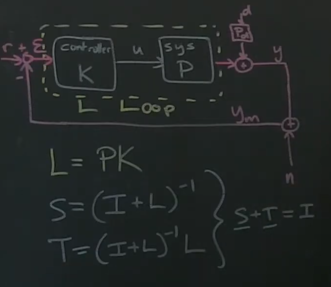
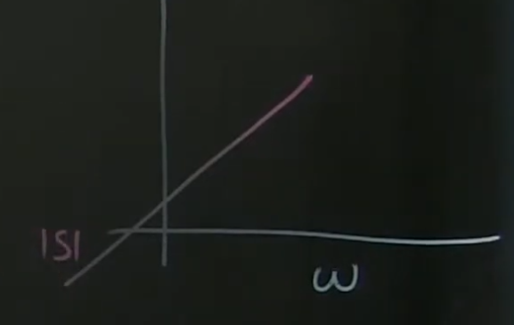
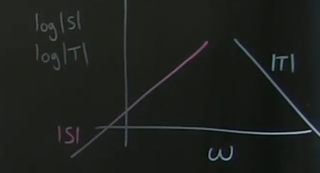
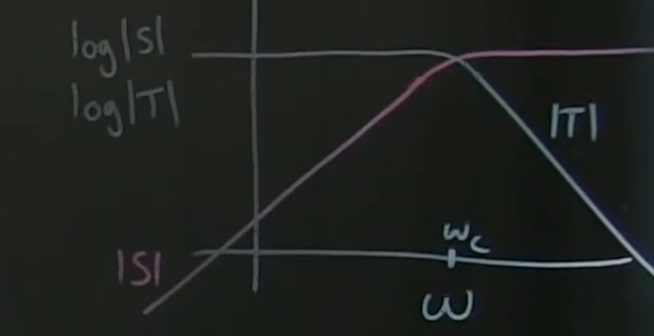

# Part 32 - [Sensitivity and Complementary Sensitivity Pt 2](https://www.youtube.com/watch?v=hEQdr1G5H2w&list=PLMrJAkhIeNNR20Mz-VpzgfQs5zrYi085m&index=32)

Goal: design $K$ such that loop transfer $L$ - and thus $S$ and $T$ - have beneficial properties for reference tracking disturbance rejection, and noise attenuation

$$y=
\underbrace{(I+PK)^{-1}PK}_{Complementary\ Sensitivity\ T}r +
\underbrace{(I+PK)^{-1}}_{Sensitivity\ S}P_dd -
\underbrace{(I+PK)^{-1}}_{T\ again}PKn$$

Looking at $\mathcal{E}$ can be more useful than looking at $y$
- $y=Tr + SP_dd - Tn$
- Since $n$ is behind $y_m$ - just like $d$ - _so they have to have the same transfer function in front of them when writing out_ $y_m$
- $y_m=Tr+SP_dd+Sn$
- Since $S+T=I$, $S=I-T$, thus:

$$
\mathcal{E}=r-y_m \\
=r - Tr - SP_dd - Sn \\
=(I-T)r-SP_dd - Sn \\
=Sr-SP_dd - Sn
$$

What do we want $\mathcal{E}$ given some reference value $r$?
- Realistic to want good reference tracking for sufficiently slow change in reference
  - Not going to be able to track $r$ if it's changing ridiculously fast, but for low frequencies we want good tracking

Good way to think about it is Bode plots for $S$ and $T$
- We want $\mathcal{E}$ to essentially be zero, so we want $S$ to be really small for low frequencies $r$

  

- Same with disturbance rejection: can't compensate for arbitrarily fast disturbances, but want to keep errors small for low freq $d$

_Note: there was an error in Steve's presentation where he should be using S instead of T for noise term. Transcribing here assuming T was actually correct_

- Noise is usually high frequency, so we want $T$ to be attenuated at high frequencies

Keep in mind $S+T=1$, so can't have $S$ low all the time or $T$ would be big, or $T$ be small since $S$ would be big
- "Crossover point" where $S$ rolls off at some point, and $T$ rolls off at some point

  - Sensitivity begins to get large and the Complimentary Sensitivity begins to get small
  - $w_c$ allows us to set where noise is going to dominate vs disturbances
- Can think of it in terms of $y$ as well: want $T$ to be high, so that $y$ approaches $Tr$
- If we know the crossover point, then we can start to design the loop $L$
