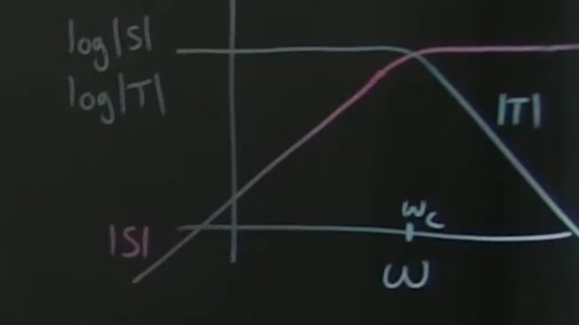
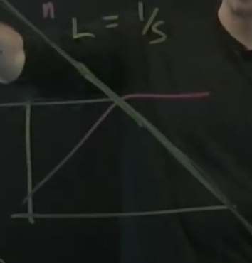

# Part 33 - [Loop Shaping](https://www.youtube.com/watch?v=sfNwLmgK5sE&list=PLMrJAkhIeNNR20Mz-VpzgfQs5zrYi085m&index=33)

Recap:
$$L=PK \\
S=(I+L)^{-1} \\
T=(I+L)^{-1}L \\
S + T = I$$

Loop function $L=PK$
- Easy to change $K$ since it's under our control; can design $K$
- If we want $S$ to be really really small, the only way to do that with $S=(I+L)^{-1}$ is to make $L$ really big
- Conversely for $T$, for high frequencies we want $T$ to be large which means $L$ has to be small
- So you end up with an $L$ that looks like $\frac{1}{s}$, aka an "integrator" in the frequency domain

  

  - Again, big $L$ at low frequencies means good reference tracking and disturbance rejection, and small $L$ at high frequencies means good noise rejection
- To move $L$ to the left or right, move it around by $w_b$ (bandwidth frequency)

Goal: cook up control $K$ that looks like an integrator $\frac{1}{s}$
- To move the transfer function to the right because we need better robustness towards deficiencies, we increase $w_b$
- If we have too much sensor noise, we move the transfer function to the left via decreasing $w_b$
- Performance in general: where does integrator $L$ cross 0db line?

Commonly define $w_b$ as the frequency $\omega$ where the log transfer function $L$ crosses 0db
- Ideally high gain at low frequency and low gain at high frequency because it has good sensitivity and complementary sensitivity
- In turn, gives good reference tracking, disturbance rejection, and noise attenuation

Up next: $S$ tells us directly if our system will be robust or fragile.
- If sensitivity curve $S$ has a peak at a certain frequency, that's A Bad Thing:tm:
- The bigger the peak, the worse the sensitivity; the less robust
- Goal: design controller $K$ to have good loop transfer function properties, and also to decrease the highest bump in the sensitivity function
