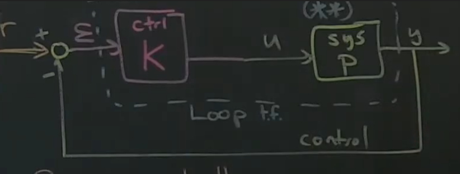

# Part 34 - [Loop Shaping Example for Cruise Control](https://www.youtube.com/watch?v=fkYcCCujOjc&list=PLMrJAkhIeNNR20Mz-VpzgfQs5zrYi085m&index=34)

Going back to cruise controller example
- Recap
  - Car has system dynamics $\dot{x}=-x+u$ and $y=x$
  - Results in transfer function $\frac{\bar{y}(s)}{\bar{u}(s)}=P(s)=\frac{1}{s+1}$
- Pole at $s=-1$
  - Stable pole in left half plane
- Want to design $K$ such that the loop transfer function is an integrator ($\frac{Q}{s}$), but
  choose the crossover point aka bandwidth to be about $\omega=Q$ (Note: Steve initially uses $K$, but that's an overloaded variable)
  - Effective reference tracking for frequencies below $Q$ ($L$ is large), and noise attenuation properties for frequencies above $Q$ ($L$ is small)

Designing a loop transfer function $\frac{10}{s}$
- Naive approach (generally a **bad idea**)

$$L=PK=\frac{10}{s}$$
$$\frac{1}{s+1}K=\frac{10}{s}$$
$$K=\frac{10s + 10}{s}$$

- ***CAUTION***: This is inverting our plant; literally dividing by $\frac{1}{P}$
  - If plant $P$ had right half pole, when you inverted it the pole would become a right-half zero
  - This means it'd be an unstable system _and_ it would be un-observable _exactly where the system is unstable_
- If the model for $P$ was wrong, then hopefully feedback $y$ would help
- Down the road we'll have to do some modifications to robust-ify this process
  - For now, cruise controller it'll work fine

Matlab info
- `[num, den] = ss2tf` - State space to transfer function. Gives you the numerator and denominator for your transfer function
- In his example, can either `tfCar = tf(num, den)` or `tf('s'); tfCar = 1/(s+1)`
- `sysLoop = series(K, sysCar)`
- `sysCL=feedback(sysLoop,1,-1)`, where `1,-1` means reference $r$ is scaled by 1 and observations $y$ are scaled by -1 when combined
