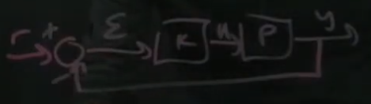

# Part 35 - [Sensitivity and Robustness](https://www.youtube.com/watch?v=7lzH-HnUFZg&list=PLMrJAkhIeNNR20Mz-VpzgfQs5zrYi085m&index=35)

Recap:
$L=PK$

$S=\left(I+L\right)^{-1}$

$T=\left(I+L\right)^{-1}L$

Background:
- Nyquist stability criteria
  - Idea: want loop transfer function $L$ to be as far away from the point $-1$ in the complex plane for _all_ frequencies

  

    - Closer it gets to -1, the less robust a system is
    - Min distance from -1 (radius) is "robustness"
  - Changes in $P$ and $K$ make curve grow/shrink from -1
    - Increasing model uncertainty $P$ and/or increased gains $K$
  - Phase changes make transfer function rotate bout origin
    - Time delays during dynamics change phase

Why is -1 so special?

  
  - $y=\frac{PK}{1+PK}r$
  - If $PK=-1$, system blows up

$S=\frac{1}{1+L}$
- Closer $L$ is to -1, $S$ becomes big
- $max\left|S\right|$ at $\omega$
