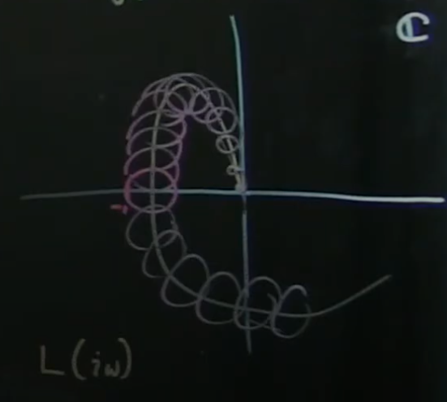
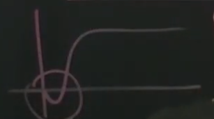

# Part 35 - [Limitations on Robustness](https://www.youtube.com/watch?v=ReAmUJMb1d8&list=PLMrJAkhIeNNR20Mz-VpzgfQs5zrYi085m&index=36)

Robustness measurement $m$
- Sensitivity function peak is $\frac{1}{m}$
  - Higher peak, closer to unstable -1 point in complex plane
  - Less robust (less able to handle inaccuracies in plant $P$)
- Uncertainty in plant can also be rendered as "cone" of uncertainty around plant function graph

  

  - If the system's uncertainty passes through -1 - even if the actual line itself doesn't - that means there's a chance the model can blow up given certain plant dynamics

Things that can cause model to blow up
- Model uncertainty
- Time delays
  - In reality there are time delays in every part of the system, including observation and control implementation
- Right-half plane zeros of $P$
- Latter two are fundamental limits on how small $max\left|S\right|$ can be
  - Only way to get around this (for now) is to lower bandwidth
  - Example: cannot control something at 500Hz if you have a 1s time delay in the system

Right-half plane zeros
- Zero in numerator that's >0
- e.g. $\frac{s-1}{s^2}$
- Step response goes in the _wrong_ direction before it goes in the correct direction

  - If you see this behavior, there's a RHP zero and a _fundamental limit_ on how high your bandwidth can be before you lose robustness
  - Acts _almost_ like a time delay
