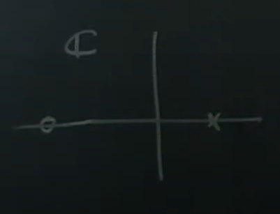

# Part 37 - [Cautionary Tale About Inverting Plant Dynamics](https://www.youtube.com/watch?v=G9apWx4iaks&list=PLMrJAkhIeNNR20Mz-VpzgfQs5zrYi085m&index=37)

$P=\frac{s+10}{s-5}$

- RHP pole at +5
  - Corresponds in the time domain to $e^{5t}$ which blows up over time
- Zero at -10

Trying to invert plant with $K$
- $K=\frac{s-5}{s+10}$
- LHP pole at -10
- RHP zero at +5

But what happens if $P$ was a bad model, and $P_{true}=\frac{s+10}{s-5+\mathcal{E}}$
- Say $\mathcal{E}=0.000001$
- Look at transfer function $L=P_{true}K=\frac{s+10}{s-5+\mathcal{E}}\frac{s-5}{s+10}=\frac{s-5}{s-5+\mathcal{E}}$
- Is _still_ a pole near +5
  - Unstable growth at $e^{(5-\mathcal{t})}$
- But _also_ has a RHP zero at $s=5$
  - Going back to observability/controllability, anything near a zero is hard to observe

Huge issue
- RHP poles around RHP zeros mean the model $P$ is _internally_ blowing up _but the measurement $y$ isn't going to tell you about it_
- If you _do_ have RHP zeros or poles, you have to do something else.
