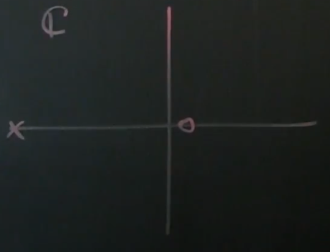
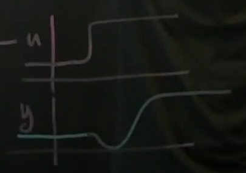

# Part 38 - [Control Systems with Non-Minimum Phase Dynamics](https://www.youtube.com/watch?v=7GjnvuKeWI8&list=PLMrJAkhIeNNR20Mz-VpzgfQs5zrYi085m&index=38)

Non-minimum phase: hard to control
1. Right-half plane zero (in transfer function)
  - $G(s)=\frac{\bar{y}(s)}{\bar{u}(s)}=\frac{s-1}{s+10}$

    

  - Stable because pole is in left half of plane
  - Zero is at +1
2. Impulse response "goes in the wrong direction" first

  

  - Implies 1 above
