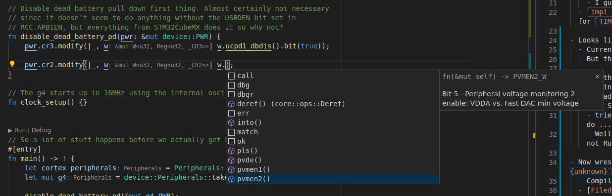

- Seeing if I can import a device crate for the stm32g4
  - Installed the stm32g474 crate, but seems to need the `svd2rust` command too...?
  - Oh, apparently all that's needed is to `use stm32g4::stm32g474` and it links in the appropriate devices files
    - Nice that I don't have to build them locally (though I will eventually to bring in all the previous SVD patches I made in the C++ codebase)
- [Good post from `cbiffle`](https://github.com/cbiffle/m4vga-rs/blob/a1e2ba47eaeb4864f0d8b97637611d9460ce5c4d/notes/20190121.md) on using `cortex-m-rt` startup, and what it does _and doesn't do_ on startup
  - looks like it initializes `.bss` and `.data` _and_ enables the FPU
  - Man, his repo is a _gold mine_
    - Example: [trick](https://github.com/cbiffle/m4vga-rs/blob/master/doc/rust-port.md) to reduce binary size by dropping panic messages if you want by `cargo build --release --no-default-features --features panic-halt`

- Trying to get the panic handler to output over ITM
  - Oh, duh; it's in a different VSCode output terminal called `SWO: ITM Port 0` :zany_face:
  - Neat, so I got it to write out the panic'd message: `[2021-03-26T22:52:22.510Z]   panicked at 'Hello panic!', app/src/main.rs:21:5`
  - Looks like the adapter can run as fast as it wants, but the `"swoFrequency"` setting in `.launch.json` has to be set at `min(CPU_freq, swo_freq)`
  - Turns out I don't need semihosting for SWO, so removed it.

- Finally got around to creating a [repo](https://github.com/timblakely/pino-rs)

- Digging into the stm32g474 crate
  - Oh man, this is amazing! All this auto-generated code I spent months writing generators for in C++, but available straight away
  - Interesting... each peripheral has its own `RegisterBlock` class _without a namespace_
    - I guess that's doable, since unless it's `pub` it stays within the file. Huh... food for thought
  - `impl RegisterBlock` adds additional functionality, like differentiating Input vs Output configuration for `TIM1`'s `CCMR[12]`

- Looks like the API for ITM could use a bit of love
  - Currently requires `let itm = unsafe {&mut *ITM::ptr() }` followed by `let stim = &mut itm.stim[0]`
  - But then `iprintln!(stim, "Hello whorld")` tends to work so...

- Going through clock statup now
  - Porting old C++ code over to Rust
  - Already hit first mini-hurdle:
    - Tried doing a `pwr.cr3.write(|w| unsafe { w.bits(0b10) })`, but according to cortex-debug that doesn't do ... anything? I wonder if we need to enable the clock for that bus or something in `RCC`...
    - Well, according to the SVD peripheral map `PWR` didn't change with the above code. But apparently it's not Rust-specific, as my old C++ code did the same, so not going to worry about it for now.

- Now wrestling with why `pwr.cr3.modify(|_, w| w.ucpd1_dbdis().bit(true))` seems to think that `w` is `w: {unknown}`
  - Compiles fine?
  - [Filed issue](https://github.com/stm32-rs/stm32-rs/issues/527)
  - Turns out a simple update to the `rust-analyzer` VSCode plugin fixed the autocomplate! Woot!
    