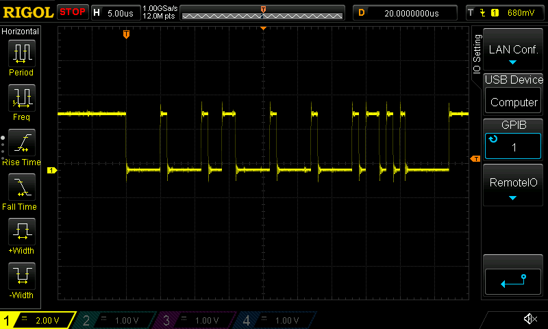
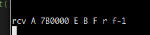
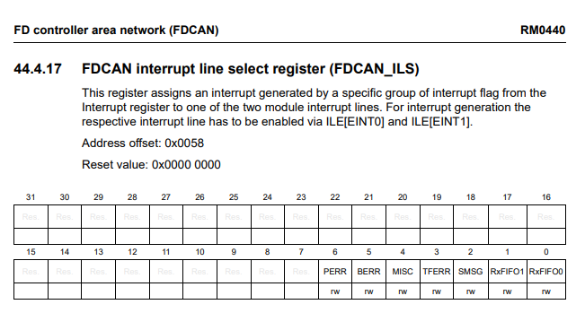
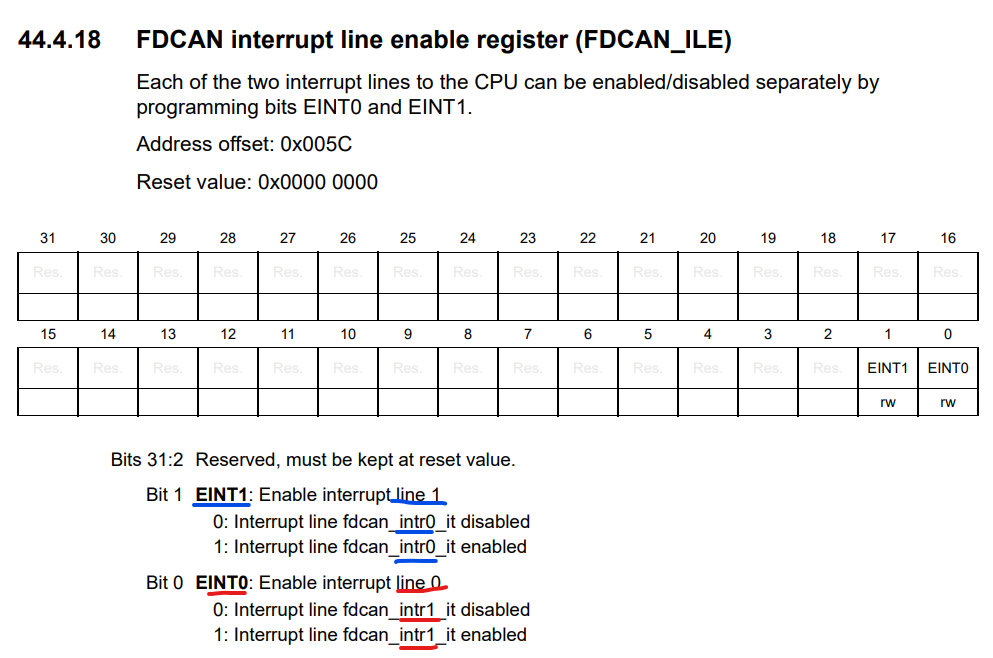

- Today's goal: send FDCAN frame!
  - Neat, just learned that `_` can be substituted for transparent type inference
    - Was trying to bit-pack a `u8` and `[u8; 3]` into a single field, 
    - Turbofish to the rescue! 
    - e.g. It's the "A type goes here, and I want you to infer it" type
    - `buffer[2] = (foo as u32) << 24 & core::mem::transmute::<_, u32>(bar);`, where `bar: &'static [u8;3]`
- Frame being transmitted!
  
  - FDCANUSB not catching it though; probably need to adjust timings or clocks a bit
  - Yup, turns out FDCANUSB doesn't like going above 5MHz. At 5 though it works:
  

- Spent some time trying to figure out why I couldn't get the `FDCAN_INTR0_IT` to fire.
  - This would _seem_ to imply that setting a bit to `0` would trigger `INTR0`, right? 
    
  - Nope; `0`=`FDCAN_INTR1_IT`, `1`=`FDCAN_INTR0_IT`. [Wat](https://www.destroyallsoftware.com/talks/wat).
  - Oh, and did I mention neither that detail _nor even the register itself is mentioned anywhere in the reference manual?!_
  - /whatisthisicanteven.jpg
    

- Okay, back to Rust. Need to figure out how to share state between ISR routines and the controller
  - Example would be transmit event buffers for FDCAN FIFO mode
  - Global state seems obvious if inelegant choice
  - Thinking about implementing a circular buffer that panics when it overlaps...