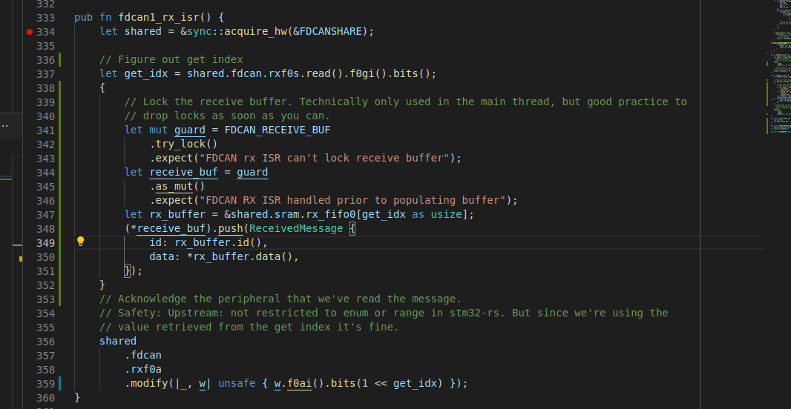
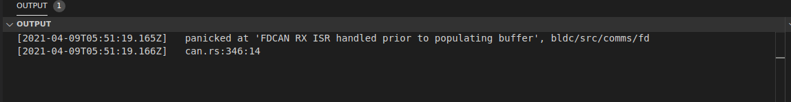

- Looking into peripheral and memory sharing without locking
  - Relevant, since we need to share a receive buffer/queue between the fdcan ISRs and
  - Implemented as a [ring buffer](https://docs.rs/ringbuffer/0.5.1/ringbuffer/) shared between the isr and the main thread, we'll see how this goes...

-Reason #34985793 why Rust is awesome: it enforces programming patterns that require you to check for situations that _could possibly occur_
  - For example, say I'm using a shared global between an ISR and the main thread. Obviously there could be some race conditions there, so there should be some locking prior to accessing data. But not only should there be locking but _condition checking to see if the lock is attainable, but the contents is actually valid_
  
  - Might seem like a bit of boilerplate there, but it's _totally_ worth it. Why? Those `.exepct()` statements just caught a genuine bug in my firmware
  - I had set up the shared ring buffer between the FDCAN Rx interrupt and the main thread so that I could pull a received frame off the peripheral's SRAM and store it really quick in the ISR for the main thread to process later
  - But: I had forgotten to actually initialize the ring buffer; it was just empty/arbitrary memory
  - And the processor `HardFault`ed, and due to the checks enforced by Rust's `Optional<T> struct`, I had this nice little message piped out the ITM port:
  - 
  - "Oh, duh. I should probably populate the buffer..."

- Now the trick is to make sure that the ring buffer isn't allocated on the stack, but is allocated in an area of memory at compile time
  - Probably going to follow [Cliff's First Mover](http://cliffle.com/blog/rust-first-mover/) pattern
  - Turns out `ringbuffer` kind of assumes it's getting allocated on the stack. Static allocation gets... weird
    - Trying out `core::mem::transmute`, but man does that get me itchy...
  - Huh. It worked?!

- Note to self: the `FDCAN.rxf0a.f0ai` field _is not a bitmask_, unlike what the reference manual suggests.
  - If the get index is `1`, you write `0x1` not `1 << 1`, or
