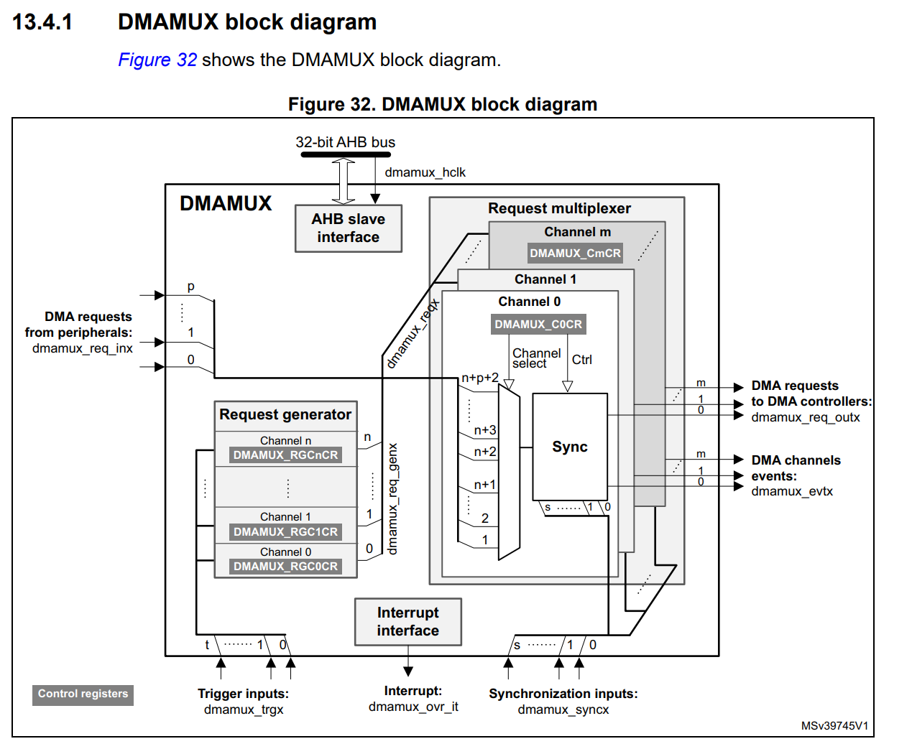
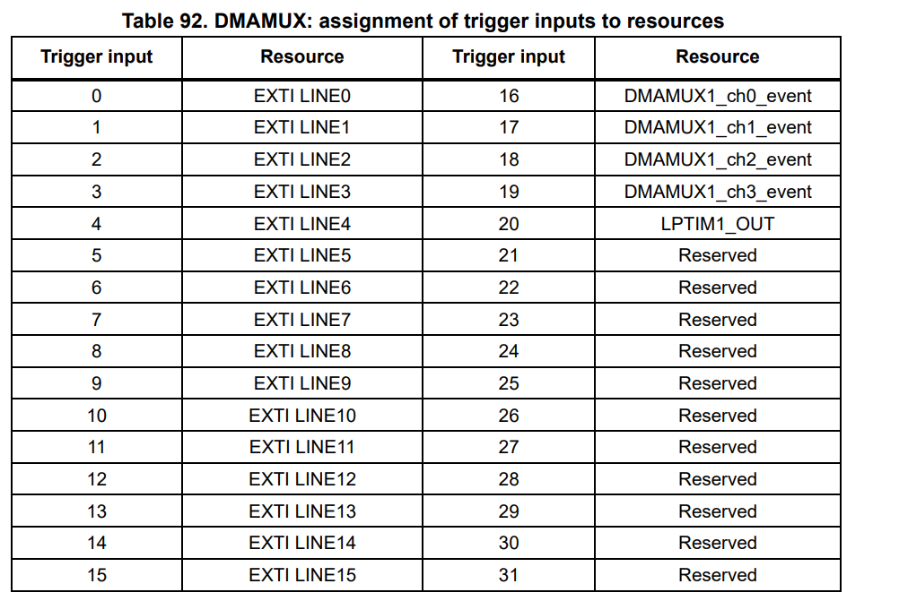
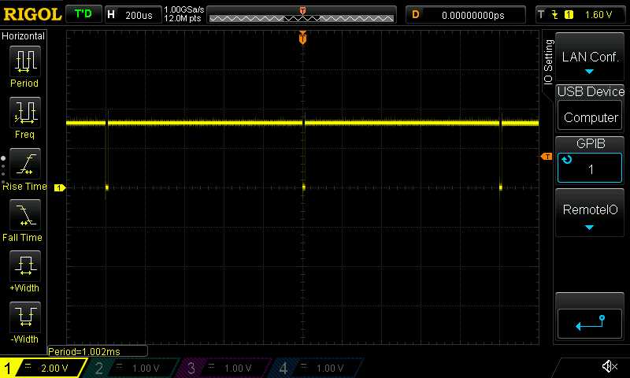
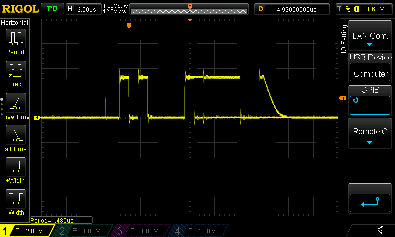

- Thinking about how to get SPI polling done automatically for external ICs like the
  [MA702](https://www.monolithicpower.com/en/documentview/productdocument/index/version/2/document_type/Datasheet/lang/en/sku/MA702/)
  or the [DRV8323RS](https://www.ti.com/lit/ds/symlink/drv8323r.pdf?ts=1618071707530)
  - Now that we have auto-CS, I think we might be able to do it in a few steps:
    1. Get the SPI set up with the right parameters + hardware NSS
    2. Set up DMA stream `A` for SPI Tx to stream output to SPI's `DR`
       - In the case of the MA702, that's just streaming `0`s out
    3. Set up DMA stream `B` for SPI Rx to stream data from `DR` to a location in memory
       - Possibly double-buffered?
       - Will have to figure out how to swap buffers or to make sure I'm not changing it mid-read,
         since we can't lock the memory from the DMA... maybe use the DMA Transfer Complete
         interrupt signal, but _without actually activating the interrupt_?
    4. Set `tim3` up to do 1kHz with as much resolution in `ARR` as possible
    5. Use `tim3_cc1_dma` to trigger DMA stream `A` to load the `DR` register
    6. Use `SPIx_RX` to trigger DMA stream `B` to read the `DR` register and pipe it somewhere in memory
  - Simple right? /famouslastwords.png
  - So I initially thought I would have to use one of the four CC DMAs, but looks like the Update
    event can cause a DMA request too
    - _Might_ be dependant on `CR2[CCDS]`... but I think I can just make it work with `CR1[UDIS]=0` (enabled)
    - Can test it out by setting `EGR[UG]=1` to trigger update event manually, even if timer isn't
      running (?)

- Setting up the DMA, got a bit confused about the difference between "DMA requests from
  peripherals" and "request generators". They... erm... sound the same?
  
  - So AFAICT, the "request generators" _aren't_ peripherals, but are actually sourced from `EXTI`
    (aka external pin interrupts)
    
  - Though it's not clear what the `DMAMUX1_chx_event` means, but will defer on that since it's
    not needed for the controller.

- So the SPI DMA transfer isn't working.. big surprise. Could be one of a number of things. First
  thing's first: compare to the working LL C++ implementation
  - First difference is that the `DMAMUX[C0CR]` register is `0x48` instead of the expected `0x41`
  - Makes sense, because the old codebase used `TIM5_CH1` as the DMA trigger, whereas I'm using
    `TIM3_UP`. Checks out
  - Next check is that `DMA1[CCR1]` is pretty wildly different: `0x2A31` vs my `0x511`
    - 5th bit is different... `CIRC`? Why is circular needed?
    - I'm transferring 16 bit while the old one was doing 32 bit. Seems okay for both peripheral and
      memory locs
    - Only other difference is priority level. So going to try circular mode...?
  - Nope, nada. Looks like it might be the timer
    - Probing tim3 vs old tim5
    - Difference in `TIMx[DIER]`: `0x1200` vs `0x100`
      - Checks out; I'm using Update and old code was using `CCxDE` (1 and 4)
    - `CCER` is pretty different, but makes sense considering I'm not using capture/compare
  - One big difference is that I was using TIM5 which is 32 bit, and now using TIM3 which is 16 bit
    - I was using an ARR of 170000... cheater :P
  - So it looks like the TIM3 timer is counting correctly; at least the `CNT` register is changing
    - Will try to trigger manually via `EGR[UG]`
    - Nope, DMA doesn't seem to be wired up correctly...?
    - Okay, so confirmed `TIM3`'s update event is occuring and firing since we can capture an
      interrupt for it.
  - Oh wait... it seems to work? Initially tried to remove the peripheral issue altogether by
    transferring between two `static` variables, but Rust is smarter than me: both were `pub
    static foo`, _not_ `pub static mut foo`
    - Both were being stored in flash instead of memory (somewhere near `0x08000xxx). Which, as it
      turns out, isn't writable
    - Moving both to ram seems to have allowed the manually triggered `EGR[UG]` to write to the
      correct memory.
    - Now to try it with the timer's update event alone, sans manual triggering. Yup, seems to work!
  - Okay, now to figure out why it wasn't triggering the SPI. Could it be it can't read from flash,
    only from memory?
    - ID-10T error: helps if the SPI peripheral is enabled....

- Okay, finally got auto-polling of SPI to work. But why is it going at 800Hz instead of 1KHz?
  Clocks messed up?
  - `TIM3` should be `170e6/4/42500`=1kHz, but it's 800Hz, which means a multiplier of... 5? I don't
    think the peripheral can even _do_ that?
  - Looks like it can: the timer frequency is prescaled by `TIMx_PSC[PSC]`, which means the
    prescalar is _actually_ `core_clock/(PSC[PSC] + 1)`.
  - I guess that makes sense; don't want to try and divide the core clock freq by zero :zany_face:

- Woot, auto-polling of MA702 over SPI via DMA!
  
  
  - The blurriness of the latter pic is due to the instability of the lower few bits of the MA702
    readout.
