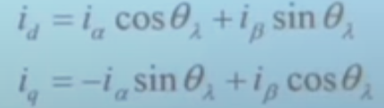
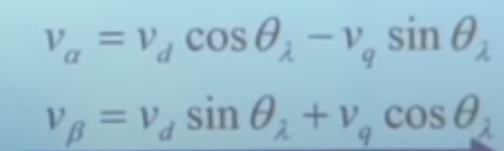
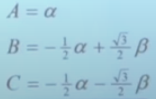
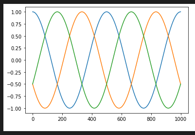
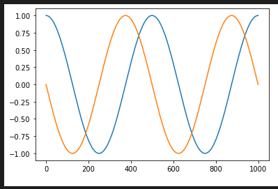
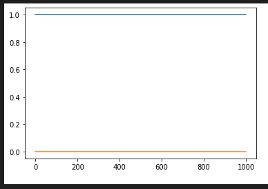
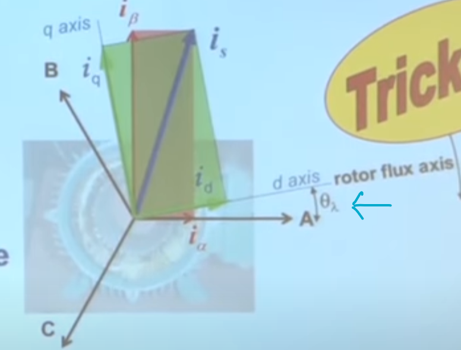

## Back at it!

- Going to update to `rust2021` and see how this goes...
  - Looks like the tool for `cargo fix` doesn't like my `third_party` setup... I think it has to do something with the `[[bin]]` and `!#[no_std]`
  - And done!
- Okay, getting a quick jupyter notebook up and runing to try and simulate a dumb motor for FOC
  - Yeesh, took way longer than expected to get Jupyter + VSCode integrated
    - Looks like a recent update added native support for Notebooks, but there's _also_ the extension? And they appear to fight each other for configuration...?
  - Oof, finally found the right incantation to change tabs to 2:
    ```json
    "notebook.editorOptionsCustomizations": {
        "codemirror_options": {
            "indentUnit": 2
        }
    }
    ```
- Okay, testing out Park/Clark transforms
  - Forward Clark:

    
  - Forward Park:

    
  - Inverse Park:

    
  - Inverse Clark:

    
  - Looking good so far (see [notebook](../../notebooks/foc_transforms.ipynb)):
    - `PerfectMotor` currents:

      

    - Clark transform:

      

    - Park transform:

      
  - One thing that's a bit counter-intuitive to me so far is the $\theta_\lambda$ in this has to be _negative_:

    
    - I guess that _kinda_ makes sense... it's the theta of $A$ _relative to_ the $d$ axis; put
      another way, what transform do you apply to get it back into $A$ space?
