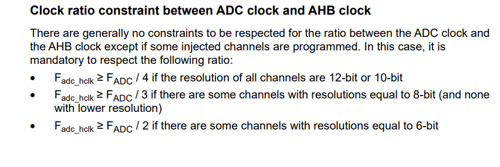

## ADCs today

Main goal: get VBus reading reliably via the ADC and written out the FDCAN bus

- Man it's been a while... refresher on ADC selections:
  1) ADC1 = SENSE_A, IN2; PA1
  1) ADC2 = SENSE_B, IN1; PA0
  1) ADC3 = SENSE_C, IN1; PB1
  1) ADC4 = SENSE_BAT, IN3; PB12  (VBUS_SENSE)
  - Hm... doesn't look like it's an AF setting, so maybe all GPIO pins are wired to some ADC channel...?
- Ah, good; had the werewithal to have the VBAT voltage divider set to 15:1, which would put 24V at 1.6V, which is right in the middle of the ADC.
  - Assuming I'm using all 12 bits, it looks like I've got `3.3*15/4096=0.012` volts/bit.
  - Nominal 24V on this revision, which brings it down to 1.6V on the sense pin, right in the middle-ish of the 3.3V Vref range
- TODO(blakely): Consider using the analog watchdog to set battery/voltage sense range
- Consideration: ADC sampling time _independent from_ AHB bus clock freq
  - Well, looks like it _can_ be? I think it can either be AHB or the PLLP clock
  - Former allows for division rates of 1/2/4, latter is 1/2/4/6/8/10/12/16/32/64/128/256
  - I think the following is only relevant with injected channels:
    
- So working on bringing up ADC4 peripheral
  - GPIO pin set to `analog()`
    - Don't think there's anything else we need to do for the ADC pins
  - Using AHB bus, so not turning on PLLP in RCC
  - But we _do_ need to turn on ADC[1-4] _peripherals_; done
  - I don't think we need

_Got a bit sidetracked by rust-analyzer telling me it can't find `test` package. [Found](https://github.com/rust-analyzer/rust-analyzer/issues/3801) that by default it tries to analyze `--all-targets` and needed to specify only the `thumbv7em-none-eabihf` target. Anyway..._

_Oh yeah, TODO(blakely): look into adding a channel for V_REFINT to make sure the V_REF is where it's supposed to be_

  - Looks like there's an internal calibration, and it has to be done _after_ waking from deep-powerdown
    - If you set `DEEPPWD`, then the ADC voltage regulator `ADVREGEN` is cleared
    - If you only clear `ADVREGEN` but stay out of `DEEPPWD`, calibration is kept
    - Calibration persists between ADC enable/disable (`ADEN`)
      - But for long periods new clibration is suggested
    - Must wait until calibration is done
    - Can technically write it directly to `ADC_CALFACT` register
    - Can only be written if ADC enabled but NOT converting (`ADEN=1` and `ADSTART=0` and `JADSTART=0`)

_Another distraction! It seems like `cargo fmt` doesn't like `edition = "2021"`, erroring out with `invalid value for '--edition' `. Guess I'll go back to 2018 for now; worst case we wait <= 6 weeks for it to roll out to the public._

  - [unindent to get around a [weird markdown bug](images/2021-07-29-00-01-32.png)...?]
    - Oof. Looks like the `TADCVREG_STUP` [startup time for the g4 is 20us](images/2021-07-29-00-03-27.png)... looks like I'm going to have to implement a blocking wait. Maybe based on systick?
    - Looks like SysTick is handled as an "exception" instead of an "interrupt"... wonder if that's nomenclature form Arm, or just convention
    - I'm going to need to implement a blocking systick handler for things that require actual timing (without sacrificing a timer)
    - Will have to do that next time...
