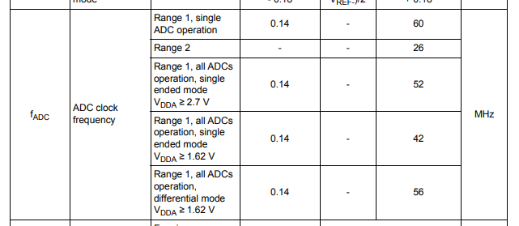
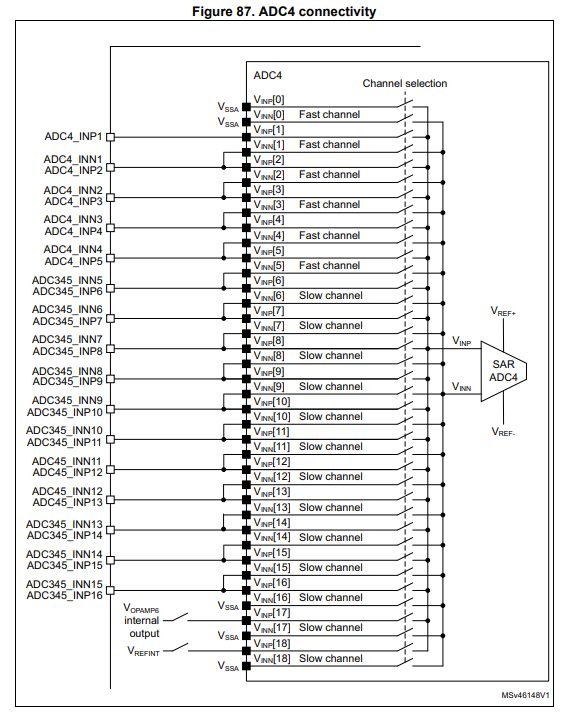
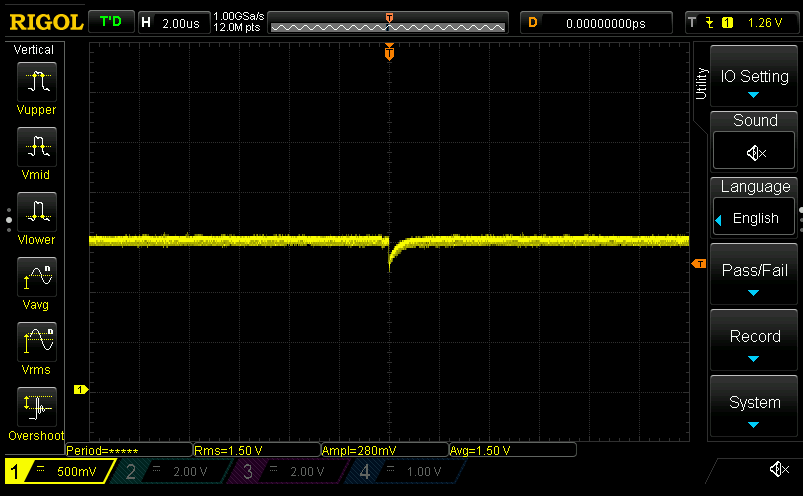
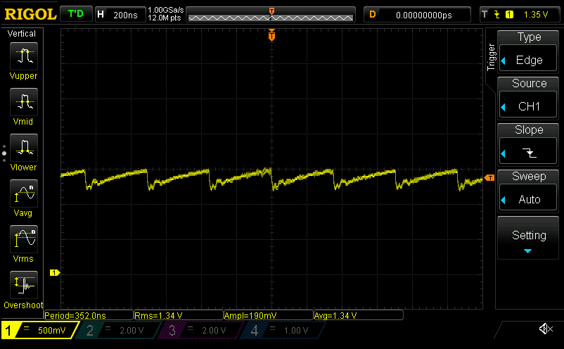
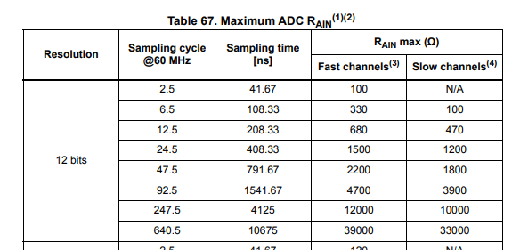

## SysTick

Need a blocking wait for the ADC calibrations from [yesterday](./20210728.md). Will try to use SysTick instead of sacrificing a timer.

- I don't want to pay for the overhead of an interrupt every tick and want to see if we can get microsecond resolution
  - Got the peripheral up and running, but seems mis-calibrated; 5e6 micros lasted less than a second...?
  - Oh, turns out I was calculating it assuming the timer was counting micros, not clock cycles
- There's a bit of subtlety to blocking for microseconds
  - SysTick is 24 bit, which means the maximum number of ticks before we hit the wrap bit is 2^24
  - If we want to sleep for something like 1s, we need to account for multiple loops
- And it works!

## Back to the ADC
- Okay, getting somewhere. Looks like I can get it into calibration mode but... it gets stuck there
  - Usually when this happens it's because there's some clock domain that's not turned on or messed up
  - Datasheet suggests max ADC freq is 60MHz for single adc, or 52 for all ADCs in single-ended mode:
    
  - 170Mhz / 4 gives about 42.5MHz, which should be fine for my purposes
  - Aha, yup! Now that `ADC345_COMMON[CCR]` has the right clocks, calibration finishes.
- Beginning startup
  - Kinda odd that you have to write 1 to `ADRDY` to clear it, but whatever :zany_face:
  - And we're running!
- Okay, now to channel setup
  - Looks like we need to use "injected" mode, since we're going to be (eventually) using an external trigger
  - Well, now that I think about it VBAT doesn't need to be triggered... might leave that for later.
    - Yeah, looks like the [application note](../../third_party/st/documents/cd00258017-stm32s-adc-modes-and-their-applications-stmicroelectronics.pdf) suggests single-channel continuous mode is for "monitor[ing] a battery voltage"
  - Sounds like you can set an arbitrary order of sampling. For now will just set single channel in `ADC_SQR1`
    - Have to make sure to set `ADC_SQR1[L]` bits to tell it how many channels we're converting (should be just 1)
  - Setting sampling time to 2.5 ADC clock cycles @42.5MHz, so ~53ns sampling time
    - Note that is is only for fast channels. Slow channels seem to need a bit more time (2x sampling time)
    - ADC4>IN3 seems to be a fast channel, so I think we're good
      
- Looking at the differences between regular and "injected" modes
  - IIUC both support hardware-trigger starting of conversions (?), and the only real difference is that "injected" J* registers are only useful if there's a regular conversion going on that needs to be interrupted...?
  - [App note](../../third_party/st/documents/cd00258017-stm32s-adc-modes-and-their-applications-stmicroelectronics.pdf) has this to say about injection mode: _"This mode can be used to synchronize the conversion of channels to an event. It is interesting in motor control applications where transistor switching generates noise that impacts ADC measurements and results in wrong conversions"_ (my use case, essentially)
  - But if I'm reading this right, you can do effectively the same thing with regular conversion mode + a HW event from a trigger...?
  - Confirmed by @EdKeyes in [Amulius Discord chat](https://discord.gg/wF3aeWC2): _"It just depends on whether the ADC is already being used for other stuff, since there are only a few of them. But if you have an otherwise idle ADC that can wait for the event, you wouldn't need to inject the channel to get it read."_
- Woo, it's doing ... something? The `DR` register is populating at least
  - 0x53 is... not what I was expecting. Guessing I've got the channel configs wrong?
    - The `SQx` registers have the channel number from 0-18... I wonder if that is off-by-one from within cubemx?
    - Aha! [ID10-T](https://en.wikipedia.org/wiki/User_error) error... [PEBKAC](https://en.wikipedia.org/wiki/User_error#PEBKAC/PEBCAK). Turns out it helps if you _sample the right friggin' channel_... ***sigh*** Note to self: CH1 != CH3
- Okay, so now I've got a "sane" reading. `0x59e` when the crappy Dr. Meter power supply reads 23.8V, and `0x4b6` when it reads 20.0V
  - Comes out to ~0.0164V/div which is way more than I was expecting. Gain error?
  - At least it's consistent? Measured factor differences:
    1) Reading 0x433@18.1: `18.1 / (0x443 / 4096 * 3.3 * 15) = 1.3728`
    1) Reading 0x5AF@24.1: `24.1 / (0x5af / 4096 * 3.3 * 15) = 1.3706`
    1) reading 0x4b6@20.0: `20.0 / (0x4b6 / 4096 * 3.3 * 15) = 1.3723`
  - I wonder if `Vref` is weird somehow? Hope it's not 3.3V*1.371=4.52V...
    - Okay, so probing shows it's 3.3V exactly. Thank you regulator
    - Probing power supply shows... It's kinda accurate? 24 on the display shows 24.06V with a multimeter
      - That's... really surprising given how craptastic the supply is, but hey, can't complain!
    - So now going to probe the voltage divider. Maybe it's not 15:1 like expected?
    - Probing the Vbat suggests it's something like 1.3 volts. That's waaay lower than expected.
      - The Vref is 3.3 on the dot, and the 24V rail is as well. Maybe the resistors are craptastic and well outta spec?
      - That's like a voltage divider of 18.46, not 15
    - Woah, wait, if I set the sampling period to 640.5 ADC clock cycles, I get a _completely_ different reading: 0x735
- Probing the Vbat line now to see what's goin' on
  - With a sampling time of 640.5 ADC clock cycles:
      
  - With a sampling time of 2.5 ADC clock cycles:
      
  - Okay, that makes some kind of sense. That just goes to show that the sampling rate can be changed. But why does it change the value so much?
  - Wait.. I'm using a voltage divider with a resistance of ~150k as the top divisor. Looking at this...
    
    - ... that seems awfully like I'm way above the resistance limit? I wonder if changing the sampling period to be way longer would allow the internal capacitors to charge
    - Nope, doesn't seem to change anything
  - Only knob that does anything is the sampling time, which gets us within 7.5% of where we're expecting to be
  - I suspect this has to do with the 150k input resistance combined with the super short sampling time
