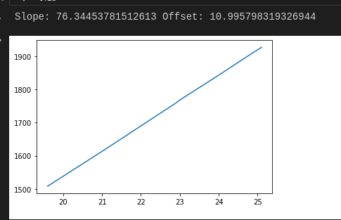

## More ADC work

So after sleeping on it I'm pretty sure it has to do with the input impedance and ADC capacitance. We're just not letting the input cap charge up fast enough to sample at 2.5 cycles. Ramping up to ~47.5 seemed to make it go away. The VBus shouldn't change all _that_ much, so I suspect that it should be okay keeping it at 47.5 ADC samples.

- Settling on 47.5 ADC samples. Seems consistent enough
- Bingo! Got continuous conversion mode up and running
  - Looks pretty linear:

    
  - Seems like it's roughly 76.345 bits/V
  - Offset of 11 though, wonder if that affects much?
  - 3.3v/Vref rail is spot on though
- Okay, digging into this the old-fashioned way: breakin' out the multimeter
  - At 24.01V on the bus, I'm reading 1.432V at the sampling pin. Calibrated ADC reads 0x733 (1843)
  - That gives us `1843/4096 * Vref = 0.450 * 3.3 = 1.485`, off by 0.053. Odd.
  - Oh, wait. Without the ADC on it's at a rock solid 1.5V. I'll bet there's Vdroop due to the sampling cap!
    - Ayup; bingo: RMS voltage due to the initial droop due to charging the sampling cap is probably the cause of the mismatch:

      
  - What to do about it though... can't slow down the ADC sampling since one of the phase current senses is on ADC, which is tied to the slave clock that drives ADC[345]
    - TODO(blakely): Potentially add a V1.1 add a cap to the ADC sampling line?
    - From AN2834:

      
      - Note the issue about cycling, which may stress the cap
  - Okay, well, it's about as good as it's going to get; jacked up the sampling time to 640.5 samples. Doesn't need to be all that real-time; lithium batteries are pretty good about handing current spikes without sag
- Gonna try to see if I can read Vref reading on ADC5. Might as well
  - Very similar to ADC4. Really should wrap this up in a HAL
  - Well that was easy
  - Looks like calculating it based on the internal Vrefint and the factory calibrated value (located at `0x1FFF75AA`) gets me even closer: looks like the battery sample is now at 1.492568V, which after the 16x increase brings us within half a percent. Good enough for me :thumbsup:

- Okay, now to do ADCs for current sensing
  - Looks straightforward enough:
    
  - Going back through the timer documentation to see exactly what signals are triggered and when
    - Aha, looks like the ADCs can _only_ be triggered by `tim_trgo2`:
      
      - Though that suggests "such as" vs "only", so might not be restricted to that
    - Well hmph... for TIM1, channels 1-3 are the PWM, channel 5 is the enforced deadtime, and I apparently used channel 4 for an interrupt (not sure why :shrug:)
    - That leaves CH6 for the trigger reference point; importantly it's on ***falling edge only***
    - Looking at the [TI app note](https://www.ti.com/lit/ug/tiducy7/tiducy7.pdf?ts=1627708655954) for current sensing:
      
    - Need to make sure we're sampling at the right point
  - Hey Timmay, STAHP: this is premature optimization
  - Just going to sample in the middle as a compromise.
