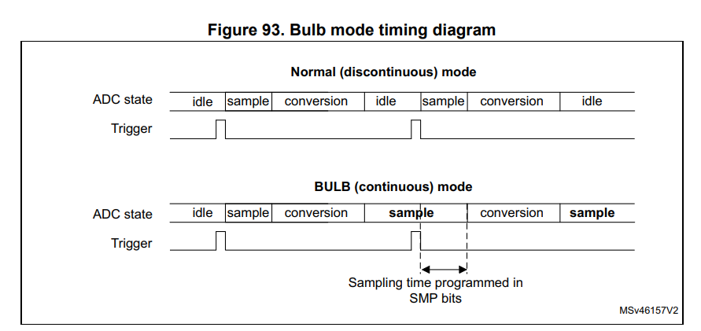
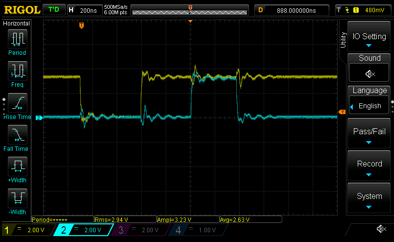
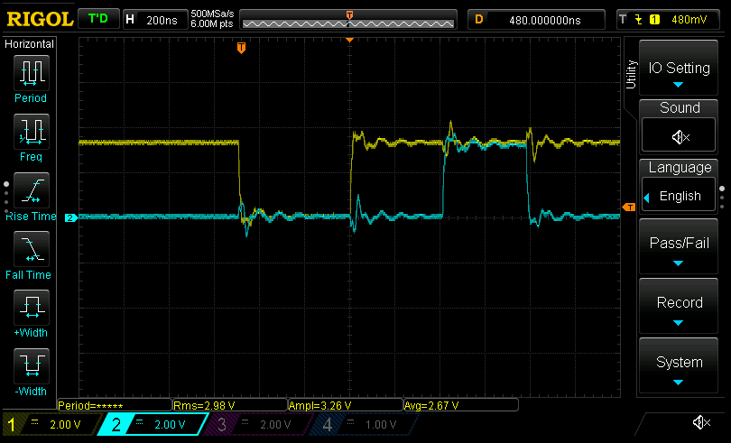

# Getting Current sense amps up

Today's goal: Trigger CSA ADCs for conversion via TIM1_CH4

- Man, I really need to refactor these ADCs into their own structs... but will do that later.
- Trying to determine whether we need "continuous" or "discontinuous" mode. I _think_ we want
  discontinuous according to this figure:
    
  - Though then again maybe not, since discontinuous seems to be able to sample a subset of the sequence.
  - And even though we want to trigger on external signals, that's _technically_ not an _injected_ read
- Okay, have ADC1 started. Now to set TIM1_CH4 to output `tim_trgo2` if we can.
  - That was surprisingly easy? Just required setting `mms2` to _"Compare - tim_oc4refc signal is used as trigger output(timtrgo2)"_ (`0b0111`)
  - Well, at the very least the EOS and EOC flags are set, as well as overrun; expected, since I don't have the interrupt for the ADC set up yet
    - Though I _do_ have the one for TIM1 still going. Gotta fix that
- And done! Now triggering on ADC EOS
  - Profiling now (release mode): bit banging the LED GPIO from the interrupt handler
  - Triggering by CH4 at 2124/2125 ARR; 99.95 duty cycle, so effectively right in the middle of the hardware-enforced deadtime
    
  - Looks like it's triggering at about 888ns after the falling edge. Calculating the center of the dead time:
    
    - 480ns, so triggered just about 240ns into dead time (slightly before)
  - So total conversion + interrupt handler entry + instruction to turn on GPIO: 888-240=648ns, or about 110 core clock cycles
  - Seems a bit on the long side...? Let's do the math
    - ADC sampling rate: 170Mhz/4 = 42.5MHz.
    - Sample duration: 2.5 _ADC clock cycles_ (not core!)
    - Conversion time: 12.5 ADC clock cycles
    - 15 clock cycles at 42.5MHz is 352ns, or 60 core clock cycles
    - Means getting into the interrupt and finally toggling the GPIO takes 110-60=50 core clock cycles
- TL;DR: 110 cycles, or about 647ns between PWM pulses, sampling the ADC, and getting into the core control loop interrupt handler
  - Not _too_ bad. At a 40KHz control loop, that's 4250-110 = 4140 clock cycles to do the control loop
  - In other words **we've got 24.353us to work with for control**
  - And now that I think about it, we might have a little bit more: I think the interrupt handlers are executing out of flash
    - Can probably speed up quite a bit by putting them in either SRAM or CCMRAM
    - Can do this in Rust via `#[link_section = ".$LINKER_SECTION"]`
