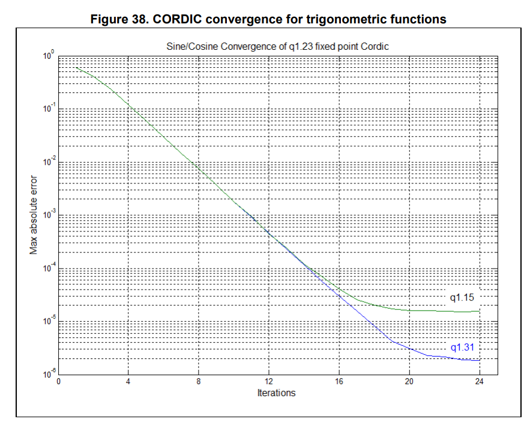

## CORDIC

Putting the ADC2&3 work on hold for now; we'll need them before commutation, but we also need to calculate sines and cosines. LUTs would work, but since we've got the hardware why not use it?

One complication: the [CORDIC](https://en.wikipedia.org/wiki/CORDIC) coprocessor on the stm32g4 uses [fixed-point math](https://en.wikipedia.org/wiki/Fixed-point_arithmetic); in particular the [Q1.31 format](https://en.wikipedia.org/wiki/Q_(number_format)). I'm familiar with how they work - it's kinda nice that they saturate on over/underflow - but I'd rather not implement my own conversions. Good thing there's [a crate for that](https://crates.io/crates/fixed)!

- Looks like precision is a function of the number of iterations (makes sense)
  
  - Seems like 18 will get me to 1e-5, so we'll start there.
  - Oops, nevermind, looks like it's multiples of 4.
  - Woah: _"The CORDIC can perform four iterations per clock cycle." That's _way_ faster than I thought it was going to be
  - Screw it, let's go to 20. That gets us 2^-18 precision (3.8E-6)
- Well that was easy
  - Can calculate sine and cosine in 1x mem load, 5 clock cycles, and 2x mem reads
    - (Cheating a little bit, that doesn't include the conversion to/from Q1.31 :zany_face:)
  - And note that the 5 clock cycles can be asynchronous
  - That's with a precision of at least 2^-18
  - Given FLASH wait states that may actually be faster than a lookup table...
