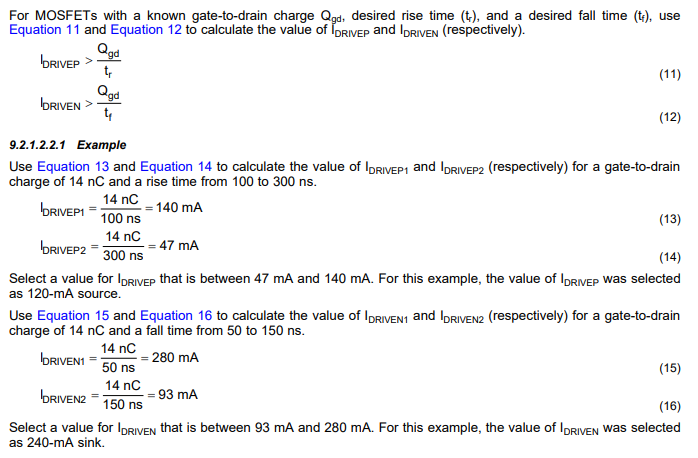
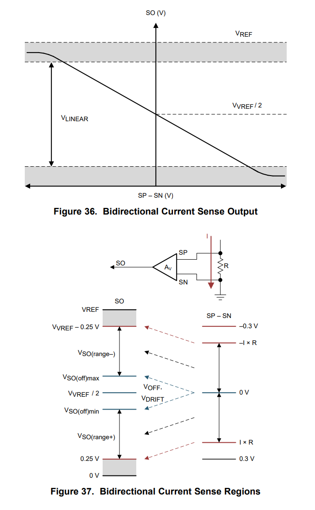
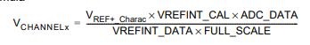
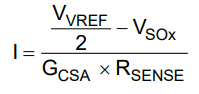
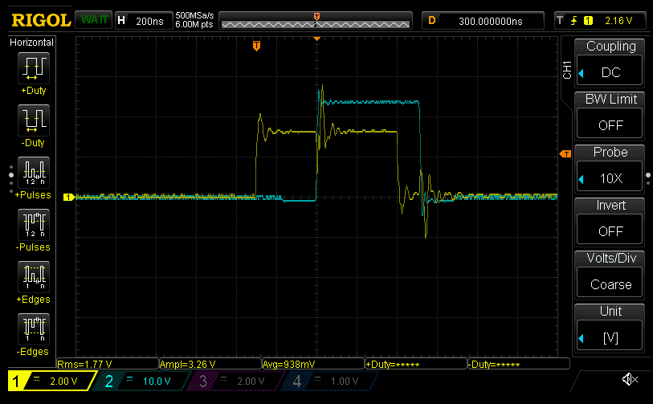

- Going to get remaining ADCs up and running, then do proper Rust ownership passing
  - Any HAL that wraps these peripherals needs to make clear if/when it's mutable. Right now I can `let adc1 = &self.mode_state.adc1;` and still modify it via `adc1.modify(|r,w|...)`
  - Okay, getting sane values on all current senses (low ~10s of millivolts, which seems sane)

Well, I've been putting this off for a while for fear of burning the board. Here goes nothing, going to try to sense the current by toggling one PWM at very low duty cycle.

- First, need to ensure the DRV is configured correctly
  - And calibrated. Can't forget to do that.
  - Ben left his gate drives at 1A. Might want to actually change that for the specific mosfets:
    
  - Hm. Running into a borrowing issue again with SPI:
    ```rust
      error[E0382]: borrow of partially moved value: `self`
      --> bldc/src/driver.rs:851:13
        |
    817 |             drv8323rs::new(self.mode_state.spi3).enable(|| gpioc.bsrr.write(|w| w.bs6().set_bit()));
        |                            -------------------- value partially moved here
    ...
    851 |             self.blocking_sleep_us(200);
        |             ^^^^ value borrowed here after partial move
        |
        = note: partial move occurs because `self.mode_state.spi3` has type `stm32g4::stm32g474::SPI3`, which does not implement the `Copy` trait

    For more information about this error, try `rustc --explain E0382`.
    ```
    - That's because I do configuration of the SPI inside of the `Drv8323rs::new`, and I pass it ownership of the SPI peripheral:
    ```rust
    pub fn new<'a>(spi: device::SPI3) -> Drv8323rs<Sleep> {
      // SPI configured
      Drv8323rs {
          spi,
          mode_state: Sleep {},
      }
    }
    ```
    - Simple enough: don't require `&mut self` for `blocking_sleep_us`; just use the wrapped function directly
- Okay! So have the DRV up and running (and hopefully calibrated)
  - TIM1 PWM is set to 0, so there really shouldn't be any current flowing
  - Have to be _really_ careful probing now that the DRV is enabled...
  - Getting 0x8C1, 0x86C, and 0x85b on all three ADCs. So they're working... kind of?
    - Wait, that might make sense if there can be negative current on one of the phases.
    - Seeing 1.8V on the SENSE_A input
    - Vref on DRV is rock-solid at 3.3V
    - Specs from Datasheet:

      

  - Okay, so that kind of makes sense. Going back to [a few days ago](./20210730.md) when I was getting $V_{refint}$ working, the internal calibration was 0x067B@3.0V

    
    - $V_{channel}=\frac{3.0\times0x5DF\times0x8C1}{0x67B\times4096}=1.812V$
    - So converting that over via the DRV's bidirectional sensing equation:

      
    - $I=\frac{\frac{V_{vref}}{2} - V_{SO_x}}{G_{CSA}\times R_{SENSE}} = \frac{\frac{3.3}{2} - 1.812}{40\times 0.001}=\dots -40A?!$

___Minor heart attack___

- Well, it did... something. A pretty loud whine came out of the coils, the power supply started current limiting at 334mA, and I shut off the power supply in panic. :scream:
  - Gonna take a break for a bit :sweat_smile:
- Okay, so it only happened when I put a breakpoint after the DRV enable, but _before_ the timer kicked off
  - It looks like as soon as the MOE bit is set the PWM signal rails to 3.3v,which in turn forces the DRV to open the high side, causing current to rush through the windings
  - I suspect the screaming I heard was actually due to the PWM current limiting. Good thing I didn't go too high with that...
  - Going to turn off the DRV and investigate the timer a bit to make sure that can't happen again.
- Took the lazy way out: don't enable the main outputs until after the timer has started :P
- But hey, the FETs are working!
  
  - Note the divisions: the blue is PHASE_A, yellow is PWM signal
  - There seems to be about ~45ns of jitter on when the FETs actually turn on. I assume this is somewhat normal?
  - The lag between the rising PWM edge and FET turn on is about 250-300ns. Pretty slow...
    - Wonder if it has to do with the deadtime insertion?
- Also it appears release mode doesn't play nice with the DRV startup code. Will have to look into that
  - I suspect that it's optimizing something away in `bitfield.rs`
