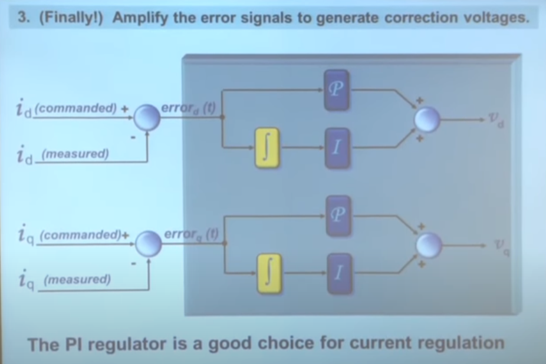

# Moving data into ISRs

Okay. Trying to Get something up and running that moves information from the main loop (FDCAN
message processor) safely inside the control loop interrupt handler.

- Got the transaction up and running
  - Not exactly the cleanest API; will have to rethink later.
  - Ah, much better: hide the fact entirely from the end user. Instead, create the `BufferedState`
    inside the run function, allowing the user to pass in whatever state they want.
- Now I just have to figure out how to get into the control loop callback from the interrupt...
  - [m4vga has an interesting
    approach](https://github.com/cbiffle/m4vga-rs/blob/a1e2ba47eaeb4864f0d8b97637611d9460ce5c4d/m4vga/src/rast/mod.rs#L120)
    using something called an `IRef`, which I assume is short for `InterruptReference`
    - Looking it over it's not quite what I think I need. Cliff's version ends up loaning a
      reference for the duration of a `scope` closure. This `scope` is actually the "main loop" of
      the program,
    - It is kinda neat how he uses ` loop { vga.sync_to_vblank(); ...render frame... }`, and behind
      the scenes `sync_to_vblank()` blocks until the interrupt is called... I think?
    - [Yup!](https://github.com/cbiffle/m4vga-rs/blob/a1e2ba47eaeb4864f0d8b97637611d9460ce5c4d/m4vga/src/driver.rs#L144)
      Neat. Will have to try that later. For now just being dumb with a `SpinLock`
  - Nevermind, `SpinLock` won't work: callbacks are [fat pointers](https://guihao-liang.github.io/2020/06/06/fat-pointer)
    - `IRef` above does some [gymnastics](https://github.com/cbiffle/m4vga-rs/blob/a1e2ba47eaeb4864f0d8b97637611d9460ce5c4d/m4vga/src/rast/mod.rs#L174) to stuff a callback it into a `Cell<(usize, usize)>`
  - Okay, okay, fine, I'll butcher `IRef`
- Okay! So we've got a comms handler and a commutation handler up and running
  - Good to know that you can now put `#[interrupt]`s in their respective files
  - Man, the main program is now pretty concise...
- Next up: moving peripherals into the control callback
  - Not sure I like all the indirection here, but _did_ get saved by Rust yet again
    - Turns out I was holding onto the lock for `COMMUTATION_SHARED`, which includes the `tim1`
      peripheral. When I enabled the timer, the interrupt fired and caused a panic. Score one for Rust!
- So now I've got all the pieces piped into the control loop. Now on to FOC!
  - This is the scary part... I know I'm gonna blow something up :/
  - Okay, so looks like we need two PI controllers (no D?), one for $I_d$ and one for $I_q$
    
    - (from [Teaching Old Motors New Tricks Part 2](https://www.youtube.com/watch?v=VI7pdKrchM0),
      highly recommended!)
    - It's kind of interesting that the desired $I_d$ always 0. If it's measured to be nonzero, the
      control loop will generate a corresponding correction on the output $I_d$
  - Working on my [FOC transforms](../../notebooks/foc_transforms.ipynb) notebook which I think kind
    of emulates Ben's [motor modeling scripts](https://github.com/bgkatz/motor-modeling)
