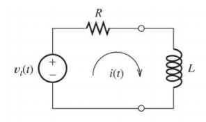
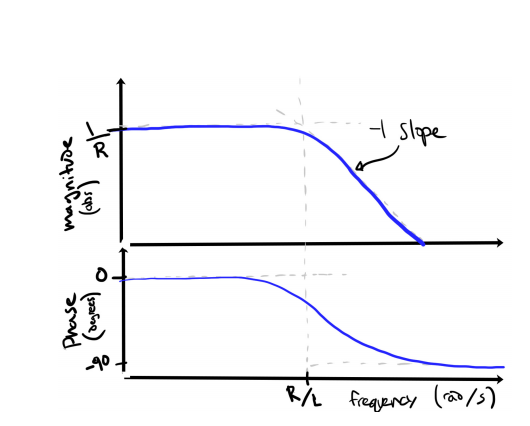
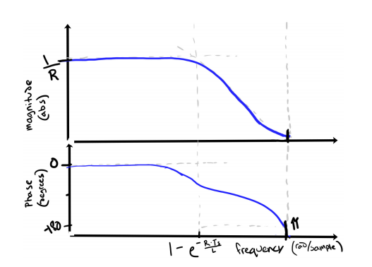

# PID loop

Trying to understand/calculate the values I'm going to need. [Ben's are commented but unclear](https://github.com/bgkatz/motorcontrol/blob/2fa6cabbebcb19efb9d6b2dd0f59edc3537ad64f/Core/Inc/hw_config.h#L55)

Figured out the $I_q$ and $I_d$ inductances just like [Ben
did](https://build-its-inprogress.blogspot.com/2016/02/motor-control-progress-working-hardware.html)
- Used a 10$\Omega$ resistor and a rechargeable battery (DC meter switching introduced way too much
  noise) and set positive to phase A and grounded phases B&C
- Measured max voltage, then measured 63% of that value and set the trigger on the scope there
- Turned the motor until I got the least amount of rise time to time constant $\tau$: 6.8$\mu$s
- That translates to $L=\tau\cdot R=6.8\times10^{-6}\cdot\left(10\Omega +\frac{1}{\frac{1}{0.200\Omega} + \frac{1}{0.200\Omega}}\right)=6.8\times10^{-6}\cdot10.3=70\mu H$
- $I_d$ and $I_q$ are assumed to be the same since this is a surface permanent magnet motor (induction motors need more care)

## System model in Continuous and Discrete time

- Continuous time frequency response $\frac{I(s)}{V(s)}$ has the transfer function $\frac{I(s)}{V(s)}=\frac{1}{Ls+R}$
  - Bode plot

    
  - First order low-pass filter with a DC gain of resistance $\frac{1}{R}$
  - Cutoff frequency of $\frac{R}{L}$
- Converting to discrete time, and design controller there
  - Through algebra $\frac{U(z)}{E(z)}=\frac{\frac{1}{R}\left(1-e^\frac{-RT_s}{L}\right)}{z-e^\frac{-RT_s}{L}}$
    - $T_s$ is sample time in seconds (0.000025 for 40kHz loop)
    - Discrete bode plot

      
      - Note that the phase drops to -180 at $\pi$ radians per sample

## Designing the controller
- Discrete-time PI controller: $\frac{U(z)}{E(z)}=k\left(1+\frac{ki}{z-1}\right)$
  - Has a pole at $z=1$ and a zero at $1-ki$
  - $k$ is high freq. gain
    - Changing $k$ only changes the loop gain
    - Changing $ki$ only changes the zero location
    - This is contrary to the typical parallel PI expression
