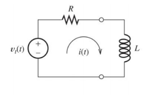

# Deriving discrete-time control from the systems level

Okay, so I've learned a bit about laplacians, systems modeling, and transfer functions. Let's see if I can model this from first principles (with a _lot_ of help from [Ben's thesis](https://dspace.mit.edu/handle/1721.1/118671))

Table of common laplacians:

$$
\begin{array}{c:c}
 f(t) & f(s) \\ \hline
\delta(t) & 1 \\
x(t) & x(s) \\
\dot{x}(t) & sx(s) - x(0)\\
\ddot{x}(t) & s^2x(s) - sx(0) - \dot{x}(0)
\end {array}
$$

## System we're going to model

Since the mechanical responses are a few orders of magnitude slower than the electrical, we'll ignore the mechanical dynamics and only concentrate on the simplified stator loop:

- Starting from $v=iR$ and $v=L\frac{di}{dt}$, we can get the continuous voltage for this system as $v(t)=iR+L\frac{di}{dt}$
- If we want the continuous time frequency response - aka the response to an impulse at $\delta(t)$ - we need to move to laplacian space
  - The output is current $i(s)$ with control effort $v(s)$, so transfer function is $i(s)=H(s)v(s)$, where $H(s)$ is the _transfer function_
    - By algebra, $H(s)=\frac{i(s)}{v(s)}=\mathcal{L}\begin{Bmatrix}\frac{i(t)}{v(t)}\end{Bmatrix}$
  - $v(s)=\mathcal{L}\begin{Bmatrix}v(t)\end{Bmatrix}=\mathcal{L}\begin{Bmatrix}i(t)R+L\frac{di}{dt}\end{Bmatrix}$
  - Given table above, plugging in gives us $v(s) = i(s)R + Lsi(s) - i(0)$
  - Rearranging, assuming $i(0)=0$: $\frac{v(s)}{i(s)}=R + Ls$, and inverting for $H(s)$ gives $H(s)=\frac{i(s)}{v(s)}=\frac{1}{Ls + R}$
  - Note that it has a single pole at $-\frac{R}{L}$
- Now calculate the steady state response by setting $s=j\omega$ i.e. $H(j\omega)$
  - $H(j\omega)=\frac{1}{Lj\omega+R}$
  - Separate imaginary numbers in denominator by multiplying by the complex conjugate $\frac{R-Lj\omega}{R-Lj\omega}$
  - $H(j\omega)=\frac{1}{Lj\omega+R}\cdot\frac{R-Lj\omega}{R-Lj\omega}=\frac{R-Lj\omega}{R^2+L^2\omega^2}=\frac{R}{R^2+L^2\omega^2}-\frac{Lj\omega}{R^2+L^2\omega^2}$
